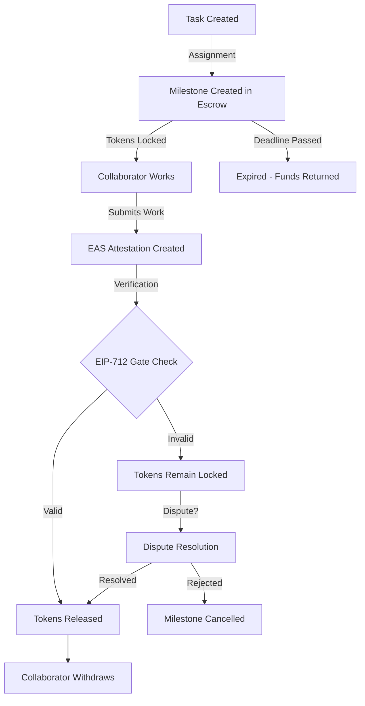

# 🔐 ESPECIFICACIONES DETALLADAS DEL MILESTONE ESCROW

## 🎯 QUÉ SE ESPERA DEL ESCROW - FUNCIONALIDADES CRÍTICAS

### 1. **SEGURIDAD ABSOLUTA DE TOKENS** 🔒
```solidity
// Los tokens CGC deben estar 100% seguros
// NADIE puede sacarlos sin cumplir las condiciones
// Ni siquiera el owner del contrato

contract MilestoneEscrow {
    // Tokens bloqueados hasta que se cumplan TODAS las condiciones
    uint256 public totalLocked;
    uint256 public totalAvailable;
    
    // Imposible de hackear o manipular
    modifier onlyWithValidProof(bytes32 taskId, bytes memory proof) {
        require(
            taskRules.validateCompletion(taskId, proof),
            "Invalid proof - tokens stay locked"
        );
        _;
    }
}
```

### 2. **LIBERACIÓN CONDICIONAL CON UN SOLO GATE** 🚪
```solidity
// UN SOLO GATE: Las reglas EIP-712
// Si las reglas dicen SÍ → tokens liberados
// Si las reglas dicen NO → tokens bloqueados

function releaseFunds(
    bytes32 milestoneId,
    bytes memory easAttestation,
    bytes memory signature
) external {
    // GATE ÚNICO: Validación EIP-712
    bool valid = taskRules.validateTaskCompletion(
        milestoneId,
        easAttestation,
        signature
    );
    
    if (valid) {
        // Liberar exactamente la cantidad prometida
        _release(milestone.collaborator, milestone.amount);
    } else {
        // Los tokens permanecen bloqueados
        revert("Gate check failed - tokens remain locked");
    }
}
```

### 3. **LIBERACIÓN DE CUALQUIER CANTIDAD** 💰
```solidity
// Debe poder liberar desde 1 wei hasta millones de tokens
// Basado en la complejidad de la tarea

mapping(uint8 => uint256) public rewardTiers;

constructor() {
    rewardTiers[1] = 100 * 10**18;  // Tarea simple: 100 CGC
    rewardTiers[2] = 110 * 10**18;  // Tarea media-baja: 110 CGC
    rewardTiers[3] = 120 * 10**18;  // Tarea media: 120 CGC
    rewardTiers[4] = 135 * 10**18;  // Tarea compleja: 135 CGC
    rewardTiers[5] = 150 * 10**18;  // Tarea crítica: 150 CGC
    // Puede extenderse a cantidades custom
}

function createCustomMilestone(
    bytes32 taskId,
    address collaborator,
    uint256 customAmount // Cualquier cantidad
) external onlyAuthorized {
    // Permite rewards especiales para tareas especiales
    milestones[taskId] = Milestone({
        amount: customAmount, // Flexible
        collaborator: collaborator,
        released: false
    });
}
```

### 4. **MANEJO DE MÚLTIPLES MILESTONES SIMULTÁNEOS** 📊
```solidity
// Puede manejar miles de milestones al mismo tiempo
// Cada uno con su propio estado y condiciones

struct Milestone {
    bytes32 taskId;
    address collaborator;
    uint256 amount;
    uint256 createdAt;
    uint256 deadline;
    bool released;
    bool cancelled;
    MilestoneStatus status;
}

enum MilestoneStatus {
    PENDING,      // Esperando trabajo
    IN_PROGRESS,  // Siendo trabajado
    SUBMITTED,    // Esperando verificación
    VERIFIED,     // Listo para liberar
    RELEASED,     // Fondos liberados
    EXPIRED,      // Deadline pasado
    DISPUTED      // En disputa
}

// Mapeo eficiente para búsquedas rápidas
mapping(bytes32 => Milestone) public milestones;
mapping(address => bytes32[]) public collaboratorMilestones;
mapping(uint256 => bytes32[]) public milestonesByDeadline;
```

### 5. **PREVENCIÓN DE DOBLE GASTO** 🛡️
```solidity
// Imposible liberar los mismos fondos dos veces
// Imposible crear milestones duplicados

modifier preventDoubleSending(bytes32 milestoneId) {
    require(!milestones[milestoneId].released, "Already released");
    require(!milestones[milestoneId].cancelled, "Already cancelled");
    _;
}

// Reentrancy guard
bool private locked;
modifier nonReentrant() {
    require(!locked, "No reentrancy");
    locked = true;
    _;
    locked = false;
}
```

### 6. **RECUPERACIÓN DE FONDOS NO RECLAMADOS** ♻️
```solidity
// Si un milestone expira, los fondos vuelven al pool
// Si un colaborador no reclama, auto-return después de X tiempo

function reclaimExpiredMilestone(bytes32 milestoneId) external {
    Milestone storage m = milestones[milestoneId];
    
    require(block.timestamp > m.deadline + GRACE_PERIOD, "Not expired yet");
    require(!m.released, "Already released");
    
    // Devolver fondos al pool general
    totalAvailable += m.amount;
    totalLocked -= m.amount;
    
    m.cancelled = true;
    
    emit MilestoneExpired(milestoneId, m.amount);
}
```

### 7. **SISTEMA DE DISPUTAS** ⚖️
```solidity
// Si hay desacuerdo, sistema de resolución
// Árbitros pueden intervenir con multi-sig

mapping(bytes32 => Dispute) public disputes;

struct Dispute {
    bytes32 milestoneId;
    address initiator;
    string reason;
    bytes evidence;
    uint256 votesFor;
    uint256 votesAgainst;
    bool resolved;
}

function initiateDispute(
    bytes32 milestoneId,
    string memory reason,
    bytes memory evidence
) external {
    // Solo el colaborador o el DAO pueden disputar
    require(
        msg.sender == milestones[milestoneId].collaborator ||
        hasRole(DAO_ROLE, msg.sender),
        "Not authorized to dispute"
    );
    
    // Congelar los fondos durante la disputa
    milestones[milestoneId].status = MilestoneStatus.DISPUTED;
    
    // Crear disputa para votación
    disputes[milestoneId] = Dispute({
        milestoneId: milestoneId,
        initiator: msg.sender,
        reason: reason,
        evidence: evidence,
        votesFor: 0,
        votesAgainst: 0,
        resolved: false
    });
}
```

### 8. **INTEGRACIÓN CON EAS (ATTESTATIONS)** 📝
```solidity
// Verificación automática mediante attestations on-chain

interface IEAS {
    function getAttestation(bytes32 uid) external view returns (Attestation memory);
}

function verifyWithEAS(bytes32 milestoneId, bytes32 attestationId) external {
    Milestone storage m = milestones[milestoneId];
    
    // Obtener attestation de EAS
    Attestation memory att = eas.getAttestation(attestationId);
    
    // Verificar que corresponde a este milestone
    require(att.data.taskId == m.taskId, "Wrong attestation");
    require(att.data.completer == m.collaborator, "Wrong completer");
    require(att.attester == authorizedAttester, "Unauthorized attester");
    
    // Si todo OK, marcar como verificado
    m.status = MilestoneStatus.VERIFIED;
    
    // Auto-release si está configurado
    if (autoRelease) {
        _releaseFunds(milestoneId);
    }
}
```

### 9. **MÉTRICAS Y REPORTING** 📈
```solidity
// Tracking completo para análisis

struct Stats {
    uint256 totalMilestonesCreated;
    uint256 totalMilestonesCompleted;
    uint256 totalTokensLocked;
    uint256 totalTokensReleased;
    uint256 averageCompletionTime;
    uint256 disputeRate;
}

mapping(address => CollaboratorStats) public collaboratorStats;

struct CollaboratorStats {
    uint256 milestonesCompleted;
    uint256 milestonesAbandoned;
    uint256 totalEarned;
    uint256 averageRating;
    uint256 disputesInitiated;
    uint256 disputesLost;
}
```

### 10. **BATCH OPERATIONS PARA EFICIENCIA** ⚡
```solidity
// Procesar múltiples milestones en una transacción
// Ahorra gas significativamente

function batchRelease(
    bytes32[] calldata milestoneIds,
    bytes[] calldata proofs
) external {
    require(milestoneIds.length == proofs.length, "Length mismatch");
    
    for (uint i = 0; i < milestoneIds.length; i++) {
        // Validar cada uno con su proof
        if (taskRules.validateCompletion(milestoneIds[i], proofs[i])) {
            _releaseFunds(milestoneIds[i]);
        }
    }
}

function batchCreate(
    bytes32[] calldata taskIds,
    address[] calldata collaborators,
    uint256[] calldata amounts
) external onlyAuthorized {
    for (uint i = 0; i < taskIds.length; i++) {
        _createMilestone(taskIds[i], collaborators[i], amounts[i]);
    }
}
```

---

## 🔄 FLUJO COMPLETO DEL ESCROW



---

## 🎯 RESUMEN: EL ESCROW PERFECTO

### Debe ser:
1. **INQUEBRANTABLE** - Nadie puede robar los fondos
2. **AUTOMÁTICO** - Opera sin intervención humana
3. **FLEXIBLE** - Maneja cualquier cantidad y situación
4. **TRANSPARENTE** - Todo auditable on-chain
5. **EFICIENTE** - Batch operations y gas optimizado
6. **JUSTO** - Sistema de disputas si hay problemas
7. **INTEGRADO** - Conectado con EAS y EIP-712
8. **ESCALABLE** - Miles de milestones simultáneos

### El GATE único:
**EIP-712 TaskRules** - Si las reglas aprueban, los tokens se liberan. Si no, permanecen seguros.

---

## ⚠️ SIN ESTE ESCROW:

- ❌ No hay garantías para colaboradores
- ❌ No hay automatización de pagos
- ❌ No hay seguridad en los fondos
- ❌ No hay transparencia en el proceso
- ❌ El DAO no puede funcionar

**ES LA PIEZA CENTRAL DEL SISTEMA** - Todo gira alrededor del Escrow.