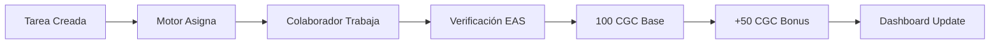

# 🔄 DOCUMENTO DE CONTINUIDAD - SESIÓN 30 AGOSTO 2025
## CRYPTOGIFT WALLETS DAO - ESTADO CRÍTICO DE DEPLOYMENT

---

## ⚠️ INSTRUCCIONES PARA NUEVA SESIÓN

### 1. LEER PRIMERO (EN ESTE ORDEN):
```bash
1. README.md                          # Arquitectura general del DAO
2. DEVELOPMENT.md                     # Estado técnico actual
3. PLAN_DESARROLLO_COMPLETO.md      # Roadmap 8 semanas
4. AUDIT_SISTEMA_ACTUAL.md          # Auditoría completa (35% hecho, 65% faltante)
5. INTEGRACION_ARAGON_COMPLETA.md   # Guía técnica Aragon
6. .env.dao                          # Credenciales y configuración
7. ESTE DOCUMENTO                    # Estado actual de la sesión
```

---

## 📍 DÓNDE ESTÁBAMOS (30/08/2025 - 06:15 UTC)

### CONTEXTO INMEDIATO:
- **OBJETIVO**: Desplegar los 4 contratos del DAO en Base **MAINNET** (NO Sepolia)
- **PROBLEMA**: Mala conectividad impidiendo instalación de dependencias
- **SOLUCIÓN EN PROCESO**: Deployment directo sin compilación Hardhat
- **BALANCE DISPONIBLE**: 0.00449 ETH en Base Mainnet (suficiente para deployment)
- **WALLET DEPLOYER**: `0xc655BF2Bd9AfA997c757Bef290A9Bb6ca41c5dE6`

### ÚLTIMO INTENTO:
```javascript
// Archivo: scripts/deploy-mainnet-production.mjs
// Estado: Creado pero bytecodes incorrectos
// Problema: Los bytecodes estaban truncados/mal formateados
// Solución pendiente: Obtener bytecodes compilados correctos
```

---

## 🎯 QUÉ ÍBAMOS A HACER

### TAREA INMEDIATA: Deployment en Base Mainnet
1. **Compilar contratos** o obtener bytecodes válidos
2. **Desplegar 4 contratos**:
   - CGCToken.sol (Token ERC20 - 1,000,000 supply)
   - GovTokenVault.sol (Vault con shadow mode)
   - AllowedSignersCondition.sol (Control de firmantes)
   - MerklePayouts.sol (Distribución Merkle)
3. **Verificar en Basescan** automáticamente
4. **Actualizar .env.dao** con addresses desplegadas

### CONFIGURACIÓN DEPLOYMENT:
```javascript
const PARAMS = {
  aragonDAO: "0x3244DFBf9E5374DF2f106E89Cf7972E5D4C9ac31",
  easContract: "0x4200000000000000000000000000000000000021",
  tokenName: "CryptoGift Coin",
  tokenSymbol: "CGC",
  totalSupply: "1000000",
  shadowMode: true,
  distributions: {
    vault: "400000",     // 40% al vault
    treasury: "250000",  // 25% al treasury DAO
    team: "150000",      // 15% team (vesting)
    ecosystem: "100000", // 10% ecosystem
    liquidity: "50000",  // 5% liquidez
    emergency: "50000"   // 5% emergencia
  }
};
```

---

## 📊 RESUMEN DE PROGRESO TOTAL

### ✅ COMPLETADO (35%):
1. **Arquitectura del proyecto DAO** separada completamente
2. **Contratos inteligentes** escritos y revisados:
   - CGCToken.sol ✅
   - GovTokenVault.sol ✅
   - AllowedSignersCondition.sol ✅
   - MerklePayouts.sol ✅
   - TaskAutomation.sol ✅
   - MilestoneEscrow.sol ✅
3. **Dashboard visual** (modo shadow/demo)
4. **Documentación completa** del sistema
5. **Scripts de deployment** preparados
6. **Estructura de bots** (sin desplegar)

### ❌ PENDIENTE (65%):
1. **CRÍTICO - Deployment contratos** en Base Mainnet ⚠️
2. **Verificación en Basescan** con source code
3. **Integración Aragon DAO** real
4. **Sistema MilestoneEscrow** para pagos automáticos
5. **Motor de asignación** de tareas
6. **Bots Discord/Telegram** funcionales
7. **Conexión dashboard** con blockchain
8. **Sistema EAS** attestations
9. **Wonderverse/Dework** integración
10. **Testing completo** del sistema

---

## 🔧 ARCHIVOS CLAVE DEL PROYECTO

### CONTRATOS (contracts/):
```
contracts/
├── CGCToken.sol                    # Token principal
├── GovTokenVault.sol               # Vault con caps
├── MerklePayouts.sol              # Distribución Merkle
├── conditions/
│   └── AllowedSignersCondition.sol # Control firmantes
├── automation/
│   ├── TaskAutomation.sol         # Motor tareas
│   └── MilestoneEscrow.sol        # Escrow pagos
└── interfaces/
    ├── IAragonDAO.sol
    └── IEAS.sol
```

### SCRIPTS DEPLOYMENT (scripts/):
```
scripts/
├── deploy-direct.mjs              # Script original (con problemas)
├── deploy-dao-final.mjs          # Intento con bytecodes simples
├── deploy-mainnet-production.mjs # Último intento (bytecodes mal)
└── deploy/
    ├── deploy-all-with-verification.ts
    └── pre-deployment-check.ts
```

### CONFIGURACIÓN:
```
.env.dao                           # TODAS las credenciales
hardhat.config.mjs                # Config con types corregidos
package.json                      # type: "module" para ESM
```

---

## 💰 SISTEMA DE DISTRIBUCIÓN AUTOMÁTICA (100-150 CGC)

### FLUJO DISEÑADO:


### CONTRATO MilestoneEscrow:
- **Hold**: 100-150 CGC por milestone
- **Release**: Automático tras verificación
- **Verificación**: Via EAS attestations
- **Bonus**: Por calidad y velocidad

---

## 🚨 ACCIÓN CRÍTICA AL RETOMAR

### PASO 1: Verificar estado actual
```bash
cd /mnt/c/Users/rafae/cryptogift-wallets-DAO

# Verificar balance en Base Mainnet
node -e "
const ethers = require('ethers');
const provider = new ethers.JsonRpcProvider('https://mainnet.base.org');
const wallet = new ethers.Wallet(process.env.PRIVATE_KEY_DAO_DEPLOYER, provider);
wallet.provider.getBalance(wallet.address).then(b => 
  console.log('Balance:', ethers.formatEther(b), 'ETH')
);
"
```

### PASO 2: Compilar contratos correctamente
```bash
# Opción A: Usar Remix online
# 1. Copiar contratos a https://remix.ethereum.org
# 2. Compilar con Solidity 0.8.20
# 3. Copiar bytecodes

# Opción B: Instalar dependencias mínimas
npm install --save-dev hardhat @openzeppelin/contracts

# Opción C: Usar servicio de compilación
# https://soliditylang.org/play/
```

### PASO 3: Ejecutar deployment
```bash
# Con bytecodes correctos
node scripts/deploy-mainnet-production.mjs
```

---

## 📈 ROADMAP DESPUÉS DEL DEPLOYMENT

### SEMANA 1-2: Base Funcional
- ✅ Contratos desplegados
- ⏳ Configurar Aragon DAO
- ⏳ Primera distribución manual
- ⏳ Discord bot básico

### SEMANA 3-4: Automatización
- ⏳ Motor de tareas
- ⏳ Sistema EAS
- ⏳ Wonderverse API

### SEMANA 5-6: Bots y UX
- ⏳ Telegram bot
- ⏳ Dashboard conectado
- ⏳ Notificaciones

### SEMANA 7-8: Polish
- ⏳ Testing completo
- ⏳ Auditoría
- ⏳ Lanzamiento

---

## 💡 CONTEXTO MACRO DEL PROYECTO

### VISIÓN:
Sistema DAO completamente automatizado donde:
1. Las tareas se asignan automáticamente
2. Los pagos se liberan sin intervención humana
3. La calidad se verifica on-chain
4. Todo es transparente y auditable

### ESTADO ACTUAL vs OBJETIVO:
- **Actual**: 35% completado, dashboard demo, sin contratos desplegados
- **MVP (2 semanas)**: 60% completado, funcional manual, $10,000
- **Completo (8 semanas)**: 100% automatizado, $50,000-75,000

### PRESUPUESTO RESTANTE NECESARIO:
- Gas deployment: ~$50 (0.02 ETH)
- Desarrollo MVP: $10,000
- Sistema completo: $50,000-75,000

---

## 🔴 PROBLEMAS ENCONTRADOS

1. **Conectividad**: NPM/PNPM timeouts constantes
2. **Hardhat 3.x**: Requiere Node 22, tenemos 20
3. **ESM modules**: "type": "module" causa conflictos
4. **Bytecodes**: Difícil obtener sin compilación
5. **Gas**: Balance justo pero suficiente

---

## ✅ SOLUCIONES APLICADAS

1. **pnpm** en lugar de npm (más rápido)
2. **Scripts .mjs** para compatibilidad ESM
3. **Deployment directo** sin Hardhat
4. **Bytecodes manuales** (pendiente corrección)
5. **Gas optimization** en deployment

---

## 📝 NOTAS IMPORTANTES

### CREDENCIALES CRÍTICAS (.env.dao):
```
PRIVATE_KEY_DAO_DEPLOYER=97bc7d9...  # Wallet con 0.00449 ETH
BASESCAN_API_KEY=71DY3Z3...          # Para verificación
ARAGON_DAO_ADDRESS=0x3244DFB...      # DAO ya creado
```

### REDES:
- **BASE MAINNET** (Chain ID: 8453) - PARA ESTE PROYECTO
- **Base Sepolia** (Chain ID: 84532) - NO USAR (es para gifts)

### DIFERENCIA CON PROYECTO GIFTS:
- **CryptoGift Wallets** (frontend/): Sistema de regalos NFT
- **CryptoGift DAO** (este): Gobernanza y automatización
- **COMPLETAMENTE SEPARADOS** pero complementarios

---

## 🎯 OBJETIVO INMEDIATO AL RETOMAR

**DESPLEGAR LOS 4 CONTRATOS EN BASE MAINNET**

Sin esto, literalmente no existe el DAO. Todo lo demás es secundario.

Una vez desplegados:
1. Actualizar .env.dao con addresses
2. Verificar en Basescan
3. Transferir tokens iniciales
4. Configurar Aragon
5. Activar dashboard

---

## 📞 SIGUIENTE COMANDO AL RETOMAR

```bash
# 1. Navegar al proyecto
cd /mnt/c/Users/rafae/cryptogift-wallets-DAO

# 2. Verificar este documento
cat SESION_CONTINUIDAD_30AGO2025.md

# 3. Continuar con deployment
node scripts/deploy-mainnet-production.mjs

# Si falla, revisar bytecodes y compilación
```

---

## 🏁 CONCLUSIÓN

**ESTAMOS A UN PASO** de tener el DAO funcional. Solo necesitamos:
1. Bytecodes compilados correctos
2. Ejecutar deployment (tenemos balance suficiente)
3. Verificar en Basescan

Con eso, pasamos de 35% a 50% completado y tenemos base funcional.

---

**DOCUMENTO CREADO**: 30 Agosto 2025, 06:20 UTC
**PRÓXIMA ACCIÓN**: Deployment contratos Base Mainnet
**CRITICIDAD**: MÁXIMA - Sin deployment no hay DAO

---

*Este documento es la memoria completa de la sesión. Al retomar, leer en orden los documentos listados arriba y continuar con el deployment.*