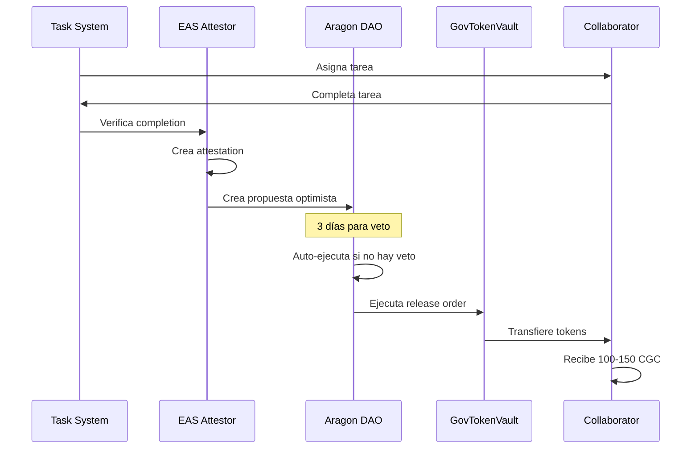

# 🏛️ Guía Completa de Integración con Aragon OSx

## 📋 Información del DAO Existente

- **DAO Address**: `0x3244DFBf9E5374DF2f106E89Cf7972E5D4C9ac31`
- **Network**: Base Mainnet (Chain ID: 8453)
- **Aragon App**: https://app.aragon.org/dao/base-mainnet/0x3244DFBf9E5374DF2f106E89Cf7972E5D4C9ac31
- **Framework**: Aragon OSx v1.4.0

---

## 🎯 Objetivos de la Integración

1. **Configurar Token Voting Plugin** para gobernanza
2. **Establecer permisos** para el GovTokenVault
3. **Implementar Optimistic Governance** para ejecución automática
4. **Conectar el dashboard** con el DAO
5. **Automatizar propuestas** desde el sistema de tareas

---

## 📚 Arquitectura de Aragon OSx

### Componentes Clave

```solidity
// 1. DAO Core Contract
interface IDAO {
    function grant(address _where, address _who, bytes32 _permissionId) external;
    function revoke(address _where, address _who, bytes32 _permissionId) external;
    function execute(bytes32 _callId, Action[] memory _actions) external returns (bytes[] memory);
}

// 2. Token Voting Plugin
interface ITokenVoting {
    function createProposal(
        bytes calldata _metadata,
        Action[] calldata _actions,
        uint256 _allowFailureMap,
        uint64 _startDate,
        uint64 _endDate
    ) external returns (uint256 proposalId);
    
    function vote(uint256 _proposalId, VoteOption _voteOption) external;
    function execute(uint256 _proposalId) external;
}

// 3. Permission IDs necesarios
bytes32 constant EXECUTE_PERMISSION_ID = keccak256("EXECUTE_PERMISSION");
bytes32 constant UPDATE_VOTING_SETTINGS_PERMISSION_ID = keccak256("UPDATE_VOTING_SETTINGS_PERMISSION");
bytes32 constant MINT_PERMISSION_ID = keccak256("MINT_PERMISSION");
```

---

## 🔧 Paso 1: Configurar Token Voting Plugin

### 1.1 Instalar Plugin en el DAO

```typescript
// scripts/setup-aragon-voting.ts
import { ethers } from "hardhat";
import { TokenVotingSetup__factory } from "@aragon/osx-ethers";

async function setupTokenVoting() {
    const DAO_ADDRESS = "0x3244DFBf9E5374DF2f106E89Cf7972E5D4C9ac31";
    const CGC_TOKEN_ADDRESS = process.env.CGC_TOKEN_ADDRESS; // Deploy primero!
    
    // Configuración del plugin
    const votingSettings = {
        votingMode: 0, // 0 = Standard, 1 = EarlyExecution, 2 = VoteReplacement
        supportThreshold: ethers.utils.parseEther("0.51"), // 51%
        minParticipation: ethers.utils.parseEther("0.1"), // 10% quorum
        minDuration: 7 * 24 * 60 * 60, // 7 días
        minProposerVotingPower: ethers.utils.parseEther("1000") // 1000 CGC para proponer
    };
    
    const tokenSettings = {
        addr: CGC_TOKEN_ADDRESS,
        name: "CryptoGift Coin",
        symbol: "CGC"
    };
    
    // Encode installation parameters
    const tokenVotingSetup = TokenVotingSetup__factory.connect(
        TOKEN_VOTING_SETUP_ADDRESS,
        signer
    );
    
    const installData = tokenVotingSetup.interface.encodeFunctionData(
        "prepareInstallation",
        [DAO_ADDRESS, [votingSettings, tokenSettings]]
    );
    
    // Crear propuesta para instalar plugin
    console.log("📦 Installing Token Voting Plugin...");
    // ... código de instalación
}
```

### 1.2 Configurar Parámetros de Votación

```typescript
// Parámetros optimizados para el DAO
const VOTING_PARAMS = {
    // Tipo de votación
    mode: "EarlyExecution", // Ejecutar cuando hay certeza matemática
    
    // Umbrales
    supportThreshold: 51, // 51% para aprobar
    minParticipation: 10, // 10% quorum
    
    // Tiempos
    minDuration: 7 * 24 * 60 * 60, // 7 días mínimo
    maxDuration: 30 * 24 * 60 * 60, // 30 días máximo
    
    // Poder de voto
    minProposerPower: 1000, // 1000 CGC para proponer
    
    // Delegación
    delegationEnabled: true,
    delegationPeriod: 30 * 24 * 60 * 60 // 30 días
};
```

---

## 🔧 Paso 2: Configurar Permisos para GovTokenVault

### 2.1 Otorgar EXECUTE_PERMISSION al Vault

```typescript
// scripts/grant-vault-permissions.ts
async function grantVaultPermissions() {
    const DAO_ADDRESS = "0x3244DFBf9E5374DF2f106E89Cf7972E5D4C9ac31";
    const VAULT_ADDRESS = process.env.VAULT_ADDRESS;
    
    const dao = await ethers.getContractAt("IDAO", DAO_ADDRESS);
    
    // El Vault necesita poder ejecutar acciones en el DAO
    const EXECUTE_PERMISSION = ethers.utils.id("EXECUTE_PERMISSION");
    
    // Crear propuesta para otorgar permiso
    const grantAction = {
        to: DAO_ADDRESS,
        value: 0,
        data: dao.interface.encodeFunctionData("grant", [
            DAO_ADDRESS, // where
            VAULT_ADDRESS, // who
            EXECUTE_PERMISSION // permissionId
        ])
    };
    
    // Crear propuesta en Token Voting
    await createProposal(
        "Grant EXECUTE permission to GovTokenVault",
        [grantAction]
    );
}
```

### 2.2 Configurar AllowedSignersCondition

```typescript
// El DAO debe ser un firmante permitido
async function setupAllowedSigners() {
    const condition = await ethers.getContractAt(
        "AllowedSignersCondition",
        CONDITION_ADDRESS
    );
    
    // Añadir DAO como firmante autorizado
    await condition.addAllowedSigner(DAO_ADDRESS);
    
    // Configurar en Aragon
    await dao.grant(
        VAULT_ADDRESS,
        CONDITION_ADDRESS,
        EXECUTE_PERMISSION
    );
}
```

---

## 🔧 Paso 3: Implementar Optimistic Governance

### 3.1 Instalar Optimistic Token Voting Plugin

```typescript
// scripts/setup-optimistic-governance.ts
import { OptimisticTokenVotingSetup__factory } from "@aragon/optimistic-voting-plugin";

async function setupOptimisticGovernance() {
    const settings = {
        minVetoRatio: ethers.utils.parseEther("0.1"), // 10% puede vetar
        minDuration: 3 * 24 * 60 * 60, // 3 días para vetar
        minProposerVotingPower: ethers.utils.parseEther("500") // 500 CGC
    };
    
    // Instalar plugin optimista
    const optimisticSetup = OptimisticTokenVotingSetup__factory.connect(
        OPTIMISTIC_SETUP_ADDRESS,
        signer
    );
    
    // Este plugin permite:
    // 1. Propuestas se ejecutan automáticamente si no hay veto
    // 2. Perfecta para releases automáticos de tokens
    // 3. Reduce fricción en operaciones rutinarias
}
```

### 3.2 Configurar Tipos de Propuestas

```typescript
// Diferentes tipos de propuestas con diferentes reglas
enum ProposalType {
    TokenRelease,    // Optimistic - auto-ejecuta
    ParameterChange, // Standard - requiere votación
    Emergency,       // Fast-track - ejecución temprana
    Integration      // Standard - votación completa
}

// Lógica para crear propuestas según tipo
function createTypedProposal(type: ProposalType, actions: Action[]) {
    switch(type) {
        case ProposalType.TokenRelease:
            return createOptimisticProposal(actions, 3); // 3 días veto
        case ProposalType.Emergency:
            return createEarlyExecutionProposal(actions, 1); // 1 día
        default:
            return createStandardProposal(actions, 7); // 7 días
    }
}
```

---

## 🔧 Paso 4: Integración con el Dashboard

### 4.1 Conectar con Aragon SDK

```typescript
// lib/aragon-client.ts
import { Context, ContextParams } from "@aragon/sdk-client";
import { TokenVotingClient } from "@aragon/sdk-client";

const contextParams: ContextParams = {
    network: 8453, // Base Mainnet
    daoFactoryAddress: "0x...", // Base OSx addresses
    web3Providers: [provider],
    ipfsNodes: [{
        url: "https://ipfs.eth.aragon.network",
        headers: { "X-API-KEY": process.env.ARAGON_IPFS_KEY }
    }]
};

const context = new Context(contextParams);
const tokenVotingClient = new TokenVotingClient(context);

// Funciones para el dashboard
export async function getActiveProposals() {
    return await tokenVotingClient.getProposals({
        daoAddressOrEns: DAO_ADDRESS,
        status: ProposalStatus.Active
    });
}

export async function createProposal(metadata: ProposalMetadata, actions: Action[]) {
    return await tokenVotingClient.createProposal({
        pluginAddress: PLUGIN_ADDRESS,
        metadataUri: await uploadToIPFS(metadata),
        actions,
        startDate: new Date(),
        endDate: new Date(Date.now() + 7 * 24 * 60 * 60 * 1000)
    });
}
```

### 4.2 UI Components para Gobernanza

```typescript
// components/governance/ProposalList.tsx
export function ProposalList() {
    const { data: proposals } = useQuery({
        queryKey: ['proposals'],
        queryFn: getActiveProposals
    });
    
    return (
        <div className="space-y-4">
            {proposals?.map(proposal => (
                <ProposalCard
                    key={proposal.id}
                    proposal={proposal}
                    onVote={(option) => vote(proposal.id, option)}
                />
            ))}
        </div>
    );
}

// components/governance/CreateProposal.tsx
export function CreateProposal() {
    const [formData, setFormData] = useState({
        title: '',
        description: '',
        type: ProposalType.TokenRelease,
        actions: []
    });
    
    const handleSubmit = async () => {
        const metadata = {
            title: formData.title,
            summary: formData.description,
            description: formData.description,
            resources: []
        };
        
        await createProposal(metadata, formData.actions);
    };
    
    // ... form UI
}
```

---

## 🔧 Paso 5: Automatización de Propuestas

### 5.1 Bot para Crear Propuestas Automáticas

```typescript
// bots/proposal-creator/index.ts
class ProposalAutomation {
    private readonly PROPOSAL_TEMPLATES = {
        weeklyRelease: {
            title: "Weekly Token Release - Week {week}",
            description: "Automated release for completed milestones",
            actions: [] // Se llenan dinámicamente
        },
        parameterUpdate: {
            title: "Update {parameter} to {value}",
            description: "Governance parameter adjustment",
            actions: []
        }
    };
    
    async createWeeklyReleaseProposal(releases: Release[]) {
        const actions = releases.map(r => ({
            to: VAULT_ADDRESS,
            value: 0,
            data: encodeReleaseOrder(r)
        }));
        
        const metadata = {
            ...this.PROPOSAL_TEMPLATES.weeklyRelease,
            title: this.PROPOSAL_TEMPLATES.weeklyRelease.title.replace(
                '{week}',
                getCurrentWeek()
            )
        };
        
        return await createOptimisticProposal(metadata, actions);
    }
    
    // Cron job para propuestas semanales
    scheduleWeeklyProposal() {
        cron.schedule('0 0 * * MON', async () => {
            const pendingReleases = await getPendingReleases();
            if (pendingReleases.length > 0) {
                await this.createWeeklyReleaseProposal(pendingReleases);
            }
        });
    }
}
```

### 5.2 Integración con Sistema de Tareas

```typescript
// Cuando se completan milestones, crear propuesta automática
async function onMilestoneComplete(milestone: Milestone) {
    // 1. Crear attestation EAS
    const attestation = await createAttestation(milestone);
    
    // 2. Preparar release order
    const releaseOrder = {
        recipient: milestone.collaborator,
        amount: milestone.tokenAmount,
        attestationId: attestation.id,
        deadline: Date.now() + 15 * 60 * 1000 // 15 min TTL
    };
    
    // 3. Crear propuesta optimista (auto-ejecuta si no hay veto)
    const proposal = await createOptimisticProposal(
        `Release ${milestone.tokenAmount} CGC to ${milestone.collaborator}`,
        [{
            to: VAULT_ADDRESS,
            value: 0,
            data: encodeReleaseWithOrder(releaseOrder)
        }]
    );
    
    // 4. Notificar en Discord/Telegram
    await notifyChannels({
        message: `Nueva propuesta de release creada: ${proposal.id}`,
        type: 'token_release',
        amount: milestone.tokenAmount
    });
}
```

---

## 📊 Monitoreo y Analytics

### Dashboard de Gobernanza

```typescript
// pages/governance/index.tsx
export default function GovernanceDashboard() {
    const stats = useGovernanceStats();
    
    return (
        <div>
            <StatGrid>
                <Stat
                    label="Propuestas Activas"
                    value={stats.activeProposals}
                    icon={<ProposalIcon />}
                />
                <Stat
                    label="Participación Promedio"
                    value={`${stats.avgParticipation}%`}
                    icon={<VoteIcon />}
                />
                <Stat
                    label="Tokens en Votación"
                    value={stats.votingPower}
                    icon={<TokenIcon />}
                />
                <Stat
                    label="Próxima Ejecución"
                    value={stats.nextExecution}
                    icon={<ClockIcon />}
                />
            </StatGrid>
            
            <ProposalList />
            <VotingHistory />
            <DelegationManager />
        </div>
    );
}
```

---

## 🚀 Flujo Completo Integrado

### Desde Tarea hasta Token Distribution



---

## 🔐 Seguridad y Best Practices

### 1. Multi-sig para Acciones Críticas
```typescript
// Requerir multi-sig para:
- Cambios de parámetros
- Emergency pause
- Upgrade de contratos
- Grandes releases (>10,000 CGC)
```

### 2. Timelock para Cambios Sensibles
```typescript
// 48 horas de delay para:
- Cambio de voting settings
- Modificación de permisos
- Actualización de contratos
```

### 3. Monitoring y Alertas
```typescript
// Alertas automáticas para:
- Propuestas de alto valor
- Cambios de parámetros
- Vetos ejercidos
- Ejecuciones fallidas
```

---

## 📝 Checklist de Implementación

### Fase 1: Setup Básico
- [ ] Deploy CGC Token
- [ ] Deploy GovTokenVault
- [ ] Instalar Token Voting Plugin
- [ ] Configurar voting settings
- [ ] Otorgar permisos básicos

### Fase 2: Optimistic Governance
- [ ] Instalar Optimistic Plugin
- [ ] Configurar veto settings
- [ ] Setup auto-execution
- [ ] Test con propuestas pequeñas

### Fase 3: Automatización
- [ ] Bot de propuestas automáticas
- [ ] Integración con task system
- [ ] Webhooks configurados
- [ ] Monitoring activo

### Fase 4: Dashboard
- [ ] Conectar Aragon SDK
- [ ] UI de propuestas
- [ ] Sistema de votación
- [ ] Analytics y reportes

---

## 🎉 Resultado Final

Con esta integración completa:

1. ✅ **Gobernanza automatizada** con Optimistic Voting
2. ✅ **Releases automáticos** de tokens
3. ✅ **Dashboard integrado** con todas las funciones
4. ✅ **Propuestas automáticas** desde el sistema de tareas
5. ✅ **Transparencia total** on-chain
6. ✅ **Mínima fricción** para operaciones rutinarias

---

*Documento creado: 29/08/2025*
*Versión: 1.0.0*

---

**Made by mbxarts.com The Moon in a Box property**
**Co-Author: Godez22 & Claude Assistant**