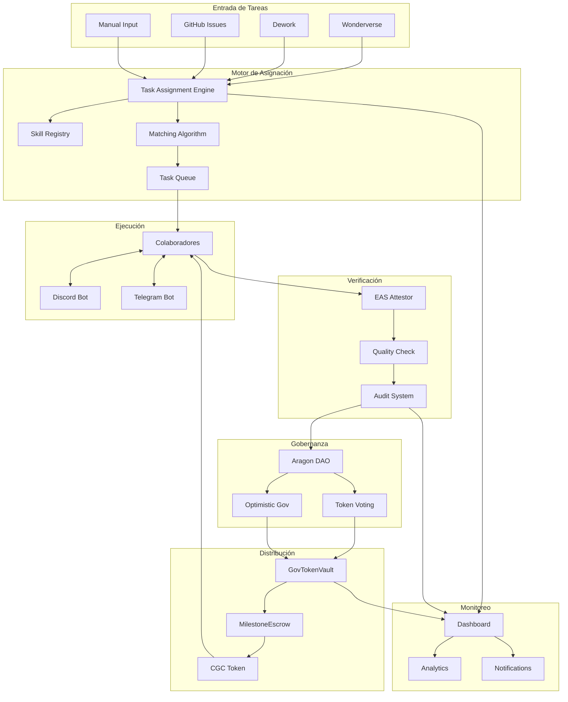

# 🚀 Plan de Desarrollo Completo - CryptoGift Wallets DAO

## 📋 Resumen Ejecutivo

### Estado Actual
- **DAO desplegado**: ✅ 0x3244DFBf9E5374DF2f106E89Cf7972E5D4C9ac31 (Base Mainnet)
- **Token CGC**: ✅ 1,000,000 tokens definidos
- **Smart Contracts**: ✅ GovTokenVault con EIP-712, shadow mode, TTL 15 min
- **Dashboard**: ✅ Next.js funcionando en modo shadow
- **Automatización**: ⚠️ Parcial (85% automatizado, falta integración completa)
- **Bots**: 🔴 No integrados
- **Aragon**: 🔴 Integración pendiente

### Objetivo Final
Sistema completamente automatizado que:
1. Asigne tareas automáticamente a colaboradores
2. Verifique completación vía EAS
3. Distribuya tokens (100-150 CGC por milestone)
4. Audite todo el trabajo
5. Funcione sin intervención manual

---

## 🎯 Análisis de Componentes Faltantes

### 1. **Despliegue de Contratos en Mainnet** 🔴 CRÍTICO
**Estado**: No desplegados
**Necesario**:
- [ ] Deploy CGCToken.sol
- [ ] Deploy GovTokenVault.sol con configuración:
  - Aragon DAO como autorizer
  - TTL 15 minutos
  - Shadow mode inicial para testing
  - Caps: 10,000 diario, 50,000 semanal, 150,000 mensual
- [ ] Deploy AllowedSignersCondition.sol
- [ ] Registrar schema EAS para attestations
- [ ] Verificar contratos en Basescan

**Tiempo estimado**: 2 días

### 2. **Sistema de Escrow para Tokens** 🔴 CRÍTICO
**Estado**: No existe
**Necesario**:
```solidity
contract MilestoneEscrow {
    mapping(uint256 => Milestone) public milestones;
    
    struct Milestone {
        address collaborator;
        uint256 tokenAmount; // 100-150 CGC
        bytes32 taskHash;
        bool released;
        uint256 deadline;
    }
    
    function createMilestone() external;
    function releaseFunds() external;
    function claimTokens() external;
}
```

**Tiempo estimado**: 3 días

### 3. **Integración Completa con Aragon** 🔴 CRÍTICO
**Estado**: DAO existe pero no está integrado
**Necesario**:
- [ ] Configurar Token Voting Plugin
- [ ] Setup permisos EXECUTE_PERMISSION
- [ ] Implementar propuestas automáticas
- [ ] Integrar Optimistic Governance Plugin
- [ ] Configurar delegación de votos

**Tiempo estimado**: 3 días

### 4. **Sistema de Asignación Automática de Tareas** 🔴 CRÍTICO
**Estado**: No existe
**Arquitectura propuesta**:

```typescript
// Task Assignment Engine
interface TaskAssignmentSystem {
  // Fuentes de tareas
  sources: {
    wonderverse: WonderverseIntegration;
    dework: DeworkIntegration;
    github: GitHubIssuesIntegration;
  };
  
  // Motor de asignación
  assignmentEngine: {
    skillMatching: SkillMatcher;
    availability: AvailabilityChecker;
    reputation: ReputationScore;
    loadBalancer: TaskLoadBalancer;
  };
  
  // Distribución de tokens
  rewards: {
    base: 100; // CGC base
    bonus: 50; // CGC por calidad/velocidad
    penalties: PenaltySystem;
  };
}
```

**Componentes necesarios**:
1. **Skill Registry**: Base de datos de habilidades de colaboradores
2. **Task Queue**: Cola de tareas priorizadas
3. **Matching Algorithm**: Algoritmo de emparejamiento tarea-colaborador
4. **Notification System**: Discord/Telegram para notificar asignaciones

**Tiempo estimado**: 5 días

### 5. **Bot de Discord Completamente Funcional** 🔴 CRÍTICO
**Estado**: Estructura básica, no funcional
**Necesario**:
```javascript
// Discord Bot Commands
/dao-stats - Ver estadísticas del DAO
/claim-task - Reclamar una tarea disponible
/submit-work - Enviar trabajo para revisión
/check-rewards - Ver tokens pendientes
/vote - Votar en propuestas activas
/leaderboard - Ver ranking de colaboradores
```

**Integraciones**:
- Webhooks con sistema de tareas
- Notificaciones en tiempo real
- Verificación de roles basada en tokens
- Sistema de tickets para soporte

**Tiempo estimado**: 3 días

### 6. **Bot de Telegram** 🟡 IMPORTANTE
**Estado**: No existe
**Necesario**:
- Bot similar a Discord pero adaptado a Telegram
- Wallet connection via WalletConnect
- Notificaciones push
- Mini-app para dashboard móvil

**Tiempo estimado**: 2 días

### 7. **Sistema de Auditoría Completo** 🟡 IMPORTANTE
**Estado**: No existe
**Arquitectura**:

```typescript
interface AuditSystem {
  // Tracking de trabajo
  workTracking: {
    commits: GitCommitAnalyzer;
    timeTracking: TimeLogger;
    deliverables: DeliverableChecker;
  };
  
  // Verificación de calidad
  qualityCheck: {
    codeReview: AutomatedCodeReview;
    testing: TestCoverageChecker;
    documentation: DocCompleteness;
  };
  
  // Reporting
  reports: {
    individual: CollaboratorReport;
    team: TeamPerformance;
    financial: TokenDistribution;
  };
}
```

**Tiempo estimado**: 4 días

### 8. **Integración EAS Completa** 🔴 CRÍTICO
**Estado**: Bot básico existe, no integrado
**Necesario**:
- [ ] Registrar schema en Base Mainnet
- [ ] Configurar bot attestor con wallet funded
- [ ] Webhooks con plataformas de quests
- [ ] API para verificar attestations
- [ ] Dashboard de attestations

**Tiempo estimado**: 2 días

### 9. **Dashboard Mejorado con Funcionalidades Reales** 🟡 IMPORTANTE
**Estado**: Dashboard estático en shadow mode
**Necesario**:
- [ ] Conexión real con contratos
- [ ] Panel de administración para:
  - Ver/aprobar tareas
  - Liberar tokens
  - Gestionar colaboradores
  - Analytics en tiempo real
- [ ] Wallet connection (WalletConnect, MetaMask)
- [ ] Historial de transacciones
- [ ] Gráficos de distribución de tokens

**Tiempo estimado**: 3 días

### 10. **Sistema de Notificaciones y Alertas** 🟡 IMPORTANTE
**Estado**: No existe
**Necesario**:
- Email notifications (SendGrid/Resend)
- Push notifications (Web Push API)
- SMS para eventos críticos
- Webhooks para integraciones externas

**Tiempo estimado**: 2 días

---

## 📈 Roadmap de Implementación

### **Fase 1: Fundación (Semana 1-2)** 🔴
1. **Desplegar contratos en Base Mainnet**
   - CGCToken.sol
   - GovTokenVault.sol
   - AllowedSignersCondition.sol
   - Verificación en Basescan

2. **Configurar Aragon completamente**
   - Token Voting Plugin
   - Permisos y roles
   - Primeras propuestas de test

3. **Activar EAS Attestor Bot**
   - Registrar schema
   - Configurar webhooks
   - Testing inicial

### **Fase 2: Sistema de Tareas (Semana 3-4)** 🟡
1. **Desarrollar MilestoneEscrow.sol**
   - Smart contract para escrow
   - Testing exhaustivo
   - Deploy y verificación

2. **Task Assignment Engine**
   - Skill registry
   - Matching algorithm
   - Task queue system

3. **Integraciones con plataformas**
   - Wonderverse API
   - Dework API
   - GitHub Issues

### **Fase 3: Automatización (Semana 5-6)** 🟢
1. **Discord Bot completo**
   - Todos los comandos
   - Verificación de roles
   - Notificaciones

2. **Telegram Bot**
   - Comandos básicos
   - Wallet connection
   - Mini-app

3. **Sistema de auditoría**
   - Work tracking
   - Quality checks
   - Reporting automático

### **Fase 4: Polish y Testing (Semana 7-8)** 🔵
1. **Dashboard mejorado**
   - Conexión real con contratos
   - Panel de admin
   - Analytics

2. **Sistema de notificaciones**
   - Email/SMS/Push
   - Alertas configurables

3. **Testing completo**
   - Simulación de ciclo completo
   - Stress testing
   - Auditoría de seguridad

---

## 💰 Presupuesto y Recursos

### Recursos Humanos Necesarios
- **1 Smart Contract Developer** (8 semanas)
- **1 Backend Developer** (6 semanas)
- **1 Frontend Developer** (4 semanas)
- **1 DevOps Engineer** (2 semanas)
- **1 QA Engineer** (2 semanas)

### Costos Estimados
- **Desarrollo**: $30,000 - $50,000
- **Auditoría de seguridad**: $10,000 - $15,000
- **Infraestructura (1 año)**: $3,000
- **Gas fees para deployment**: $2,000
- **Buffer para imprevistos**: $5,000

**Total**: $50,000 - $75,000

### Alternativa: Desarrollo Incremental
Si el presupuesto es limitado, priorizar:
1. **MVP (2 semanas, $10,000)**
   - Deploy contratos básicos
   - Bot Discord mínimo
   - Asignación manual de tareas

2. **V1 (4 semanas adicionales, $20,000)**
   - Automatización parcial
   - Dashboard funcional
   - EAS integration

3. **V2 (4 semanas adicionales, $20,000)**
   - Automatización completa
   - Todos los bots
   - Sistema de auditoría

---

## 🔧 Stack Tecnológico Recomendado

### Smart Contracts
- **Solidity 0.8.20+**
- **Hardhat** para development
- **OpenZeppelin** contracts
- **Aragon OSx** v1.4.0

### Backend
- **Node.js + TypeScript**
- **Express/Fastify** para APIs
- **Bull/BullMQ** para job queues
- **Redis** para caching
- **PostgreSQL** para data persistence

### Frontend
- **Next.js 14** (App Router)
- **Wagmi v2** para Web3
- **TanStack Query** para state
- **Tailwind CSS** para styling

### Bots
- **Discord.js v14**
- **Telegraf** para Telegram
- **node-cron** para scheduling

### Infraestructura
- **Vercel** para frontend
- **Railway/Render** para backend
- **Upstash** para Redis
- **Supabase** para PostgreSQL
- **GitHub Actions** para CI/CD

---

## ✅ Checklist de Implementación

### Semana 1-2
- [ ] Deploy CGCToken en Base Mainnet
- [ ] Deploy GovTokenVault con configuración completa
- [ ] Registrar schema EAS
- [ ] Configurar Aragon Token Voting
- [ ] Verificar contratos en Basescan

### Semana 3-4
- [ ] Desarrollar y deployar MilestoneEscrow
- [ ] Implementar Task Assignment Engine
- [ ] Integrar Wonderverse API
- [ ] Integrar Dework API
- [ ] Setup skill registry

### Semana 5-6
- [ ] Discord bot con todos los comandos
- [ ] Telegram bot funcional
- [ ] Sistema de auditoría básico
- [ ] Work tracking implementado
- [ ] Quality checks automatizados

### Semana 7-8
- [ ] Dashboard con conexión real
- [ ] Panel de administración
- [ ] Sistema de notificaciones
- [ ] Testing completo del flujo
- [ ] Documentación final

---

## 🎯 KPIs de Éxito

### Métricas Técnicas
- **Uptime**: > 99.9%
- **Tiempo de respuesta**: < 2 segundos
- **Gas optimization**: < $5 por transacción
- **Cobertura de tests**: > 90%

### Métricas de Negocio
- **Tareas completadas/semana**: > 50
- **Colaboradores activos**: > 20
- **Tokens distribuidos/mes**: > 10,000 CGC
- **Tiempo promedio tarea**: < 48 horas
- **Satisfacción colaboradores**: > 4.5/5

### Métricas de Gobernanza
- **Participación en votaciones**: > 30%
- **Propuestas aprobadas/mes**: > 5
- **Tiempo de ejecución propuestas**: < 7 días
- **Quorum alcanzado**: > 80% de votaciones

---

## 🚨 Riesgos y Mitigación

### Riesgos Técnicos
1. **Smart contract bugs**
   - Mitigación: Auditoría profesional + bug bounty
2. **Escalabilidad**
   - Mitigación: Layer 2 (Base) + optimización de gas
3. **Centralización inicial**
   - Mitigación: Progressive decentralization plan

### Riesgos Operacionales
1. **Falta de colaboradores**
   - Mitigación: Incentivos atractivos + onboarding fácil
2. **Calidad del trabajo**
   - Mitigación: Sistema de revisión + reputación
3. **Manipulación del sistema**
   - Mitigación: Anti-sybil + KYC ligero

### Riesgos Regulatorios
1. **Clasificación como security**
   - Mitigación: Utility token + no promesas de ganancia
2. **KYC/AML requirements**
   - Mitigación: Cumplimiento progresivo

---

## 📊 Arquitectura del Sistema Completo



---

## 🎉 Resultado Final Esperado

### Sistema Completamente Automatizado
1. **Tarea creada** en Wonderverse/Dework/GitHub
2. **Motor asigna** automáticamente a colaborador idóneo
3. **Notificación** vía Discord/Telegram
4. **Colaborador completa** la tarea
5. **EAS verifica** completion on-chain
6. **Quality check** automático
7. **Tokens liberados** (100-150 CGC)
8. **Dashboard actualizado** en tiempo real
9. **Reportes generados** para auditoría

### Beneficios Clave
- ✅ **Zero intervención manual** después del setup
- ✅ **Transparencia total** on-chain
- ✅ **Incentivos alineados** para calidad
- ✅ **Escalabilidad ilimitada**
- ✅ **Gobernanza descentralizada**
- ✅ **Auditoría automática** completa

---

## 📝 Próximos Pasos Inmediatos

1. **HOY**: Aprobar plan y presupuesto
2. **Mañana**: Comenzar deployment de contratos
3. **Esta semana**: 
   - Configurar Aragon completamente
   - Activar EAS attestor
   - Primer test de flujo completo
4. **Próxima semana**:
   - Desarrollar MilestoneEscrow
   - Comenzar Task Assignment Engine
   - MVP de Discord bot

---

## 📞 Contacto y Soporte

- **Technical Lead**: desarrollo@cryptogift-wallets.com
- **Discord**: [CryptoGift DAO Server]
- **Documentación**: https://docs.cryptogift-wallets.com
- **GitHub**: https://github.com/cryptogift-wallets/dao

---

*Documento creado: 29/08/2025*
*Última actualización: 29/08/2025*
*Versión: 1.0.0*

---

**Made by mbxarts.com The Moon in a Box property**
**Co-Author: Godez22 & Claude Assistant**