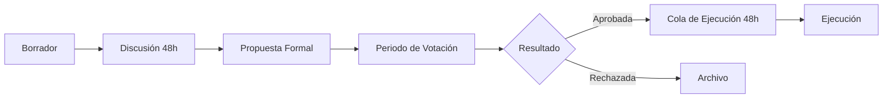
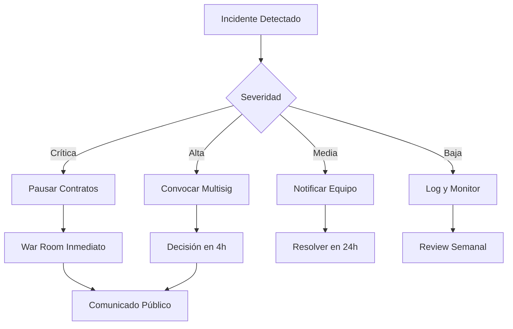

# 📋 CryptoGift Wallets DAO - Reglas de Negocio y Políticas

## 📊 Resumen Ejecutivo

Este documento define las reglas de negocio, políticas operativas y parámetros de gobernanza para CryptoGift Wallets DAO. Estas reglas están diseñadas para garantizar un crecimiento sostenible, distribución justa de tokens y participación activa de la comunidad.

---

## 1. 🪙 Economía del Token (CGC)

### 1.1 Distribución Inicial

| Categoría | Porcentaje | Cantidad | Periodo de Vesting | Uso Principal |
|-----------|------------|----------|-------------------|---------------|
| **Recompensas Educativas** | 40% | 400,000 CGC | 24 meses | Incentivos por aprendizaje |
| **Tesoro DAO** | 25% | 250,000 CGC | Sin vesting | Operaciones y desarrollo |
| **Core Contributors** | 15% | 150,000 CGC | 48 meses con cliff 6 meses | Equipo fundador |
| **Desarrollo Ecosistema** | 10% | 100,000 CGC | 36 meses | Grants y partnerships |
| **Liquidez** | 5% | 50,000 CGC | Inmediato | Pools de liquidez |
| **Reserva Emergencia** | 5% | 50,000 CGC | Bloqueado 12 meses | Contingencias |

### 1.2 Políticas de Emisión

- **No Inflación**: Supply fijo de 1,000,000 CGC
- **No Burning**: Sin mecanismos de quema programados
- **No Minting**: No se pueden crear tokens adicionales
- **Redistribución**: Tokens no reclamados vuelven al tesoro después de 90 días

### 1.3 Utilidad del Token

1. **Gobernanza**: Poder de voto proporcional a holdings
2. **Recompensas**: Distribución por completar quests y contribuciones
3. **Acceso**: Desbloquear features premium y contenido exclusivo
4. **Staking**: Multiplicadores de recompensas (futuro)
5. **Delegación**: Transferir poder de voto sin transferir tokens

---

## 2. 🎯 Sistema de Recompensas

### 2.1 Categorías de Recompensas

#### A. Educativas (40% del supply)
- **Tutorial Básico**: 10 CGC
- **Módulo Intermedio**: 25 CGC
- **Curso Avanzado**: 100 CGC
- **Certificación**: 500 CGC

#### B. Contribuciones (15% del supply)
- **Bug Report Crítico**: 100-1,000 CGC
- **Feature Implementation**: 200-2,000 CGC
- **Documentation**: 50-500 CGC
- **Community Management**: 100-500 CGC/mes

#### C. Participación (10% del supply)
- **Daily Login**: 1 CGC (max 30/mes)
- **Votación Activa**: 5 CGC por propuesta
- **Referral Exitoso**: 20 CGC
- **Social Sharing**: 2 CGC (max 10/mes)

### 2.2 Multiplicadores

| Nivel | Requisito XP | Multiplicador | Beneficios Adicionales |
|-------|-------------|---------------|------------------------|
| **Novato** | 0 | 1.0x | Acceso básico |
| **Aprendiz** | 1,000 | 1.1x | Badge especial |
| **Explorador** | 5,000 | 1.25x | Canal privado Discord |
| **Experto** | 15,000 | 1.5x | Voto doble en propuestas |
| **Maestro** | 50,000 | 2.0x | Mentor status |
| **Legendario** | 100,000 | 3.0x | Consejo asesor |

### 2.3 Cooldowns y Límites

```javascript
const LIMITS = {
  daily: {
    global: 5000,      // CGC total distribuido por día
    perUser: 500,      // CGC máximo por usuario por día
    claims: 10         // Número máximo de claims diarios
  },
  weekly: {
    global: 30000,     // CGC total distribuido por semana
    perUser: 3000,     // CGC máximo por usuario por semana
  },
  monthly: {
    global: 100000,    // CGC total distribuido por mes
    perUser: 10000,    // CGC máximo por usuario por mes
  },
  cooldowns: {
    betweenClaims: 3600,     // 1 hora en segundos
    questRepeat: 86400,      // 24 horas para repetir quest
    referralCooldown: 604800 // 7 días entre referrals del mismo usuario
  }
};
```

---

## 3. 🏛️ Gobernanza

### 3.1 Estructura de Votación

#### Tipos de Propuestas

| Tipo | Código | Quórum | Umbral | Duración | Poder Mínimo |
|------|--------|--------|--------|----------|--------------|
| **Release (REL)** | REL | 10% | 51% | 7 días | 1,000 CGC |
| **Parámetros (PAR)** | PAR | 15% | 60% | 7 días | 2,500 CGC |
| **Integración (INT)** | INT | 20% | 66% | 14 días | 5,000 CGC |
| **Emergencia (EMR)** | EMR | 5% | 75% | 3 días | 10,000 CGC |
| **Constitucional (CON)** | CON | 30% | 80% | 30 días | 25,000 CGC |

### 3.2 Proceso de Propuesta



### 3.3 Delegación

- **Delegación Parcial**: Permitida (mínimo 100 CGC)
- **Revocación**: Instantánea
- **Subdelegación**: No permitida
- **Snapshot**: Tomado al inicio de cada propuesta
- **Liquid Democracy**: Delegados pueden votar diferente a delegadores

---

## 4. 🔒 Seguridad y Compliance

### 4.1 Medidas de Seguridad

#### Smart Contracts
- **Auditorías**: Requeridas antes de deployment mayor
- **Bug Bounty**: 1-10% del valor en riesgo (max 50,000 CGC)
- **Timelock**: 48 horas para cambios críticos
- **Multisig**: 3/5 para operaciones de emergencia
- **Pausable**: Sistema puede pausarse en emergencias

#### Operacional
- **2FA**: Obligatorio para roles administrativos
- **Cold Storage**: 80% de fondos en cold wallet
- **Rotación de Keys**: Cada 90 días
- **Backup**: 3 copias en ubicaciones separadas
- **Incident Response**: Plan documentado y ensayado

### 4.2 Compliance

#### KYC/AML
- **Umbral KYC**: Transacciones > 10,000 CGC
- **Verificación**: Para contributors y grant recipients
- **Blacklist**: Direcciones sancionadas (OFAC)
- **Reporting**: Transacciones sospechosas

#### Legal
- **Jurisdicción**: Islas Vírgenes Británicas (BVI)
- **Estructura**: DAO LLC
- **Impuestos**: Contributors responsables individualmente
- **Terms of Service**: Aceptación requerida
- **Privacy Policy**: GDPR compliant

---

## 5. 📈 Métricas y KPIs

### 5.1 KPIs Principales

| Métrica | Target | Frecuencia | Responsable |
|---------|--------|------------|-------------|
| **TVL (Total Value Locked)** | $1M en 12 meses | Diario | Finanzas |
| **Usuarios Activos Mensuales** | 10,000 | Mensual | Growth |
| **Tasa de Retención D30** | >40% | Mensual | Product |
| **Quests Completados** | 1,000/semana | Semanal | Community |
| **Propuestas Aprobadas** | >60% | Por propuesta | Governance |
| **NPS Score** | >50 | Trimestral | UX |
| **Tiempo de Respuesta Soporte** | <4 horas | Diario | Support |

### 5.2 Métricas On-chain

```javascript
const METRICS = {
  tokenomics: {
    circulatingSupply: "Tokens en wallets activas",
    velocity: "Transacciones/día ÷ supply circulante",
    concentration: "Gini coefficient de distribución",
    holdTime: "Tiempo promedio de holding"
  },
  governance: {
    participation: "Votantes únicos / holders totales",
    delegationRate: "Tokens delegados / supply total",
    proposalSuccess: "Propuestas aprobadas / totales",
    executionTime: "Tiempo promedio propuesta → ejecución"
  },
  engagement: {
    dau_mau: "Daily Active Users / Monthly Active Users",
    questCompletion: "Quests completados / iniciados",
    referralRate: "Nuevos usuarios por referral",
    churnRate: "Usuarios inactivos 30 días / total"
  }
};
```

---

## 6. 🚀 Roadmap de Implementación

### Fase 1: Foundation (Q1 2025)
- [x] Deploy contratos principales
- [x] Configurar Aragon DAO
- [x] Sistema de attestations (EAS)
- [ ] Primera distribución de tokens
- [ ] Launch educación básica

### Fase 2: Growth (Q2 2025)
- [ ] Integración Zealy/Wonderverse
- [ ] Discord token gating
- [ ] Programa de referrals
- [ ] Mobile app (PWA)
- [ ] Partnerships iniciales

### Fase 3: Expansion (Q3 2025)
- [ ] Multi-chain deployment
- [ ] Bridges L2 (Optimism, Arbitrum)
- [ ] Streaming payments (Superfluid)
- [ ] NFT achievements
- [ ] Governance v2

### Fase 4: Maturity (Q4 2025)
- [ ] DAO incubator
- [ ] Grant program
- [ ] Venture arm
- [ ] Educational certification
- [ ] Token utility expansion

---

## 7. 💰 Presupuesto Operativo

### 7.1 Distribución Mensual

| Categoría | Presupuesto CGC | Presupuesto USD | Descripción |
|-----------|----------------|-----------------|-------------|
| **Desarrollo** | 10,000 | $5,000 | Smart contracts y frontend |
| **Marketing** | 5,000 | $2,500 | Campañas y contenido |
| **Operaciones** | 3,000 | $1,500 | Infraestructura y tools |
| **Community** | 8,000 | $4,000 | Rewards y eventos |
| **Legal** | 2,000 | $1,000 | Compliance y asesoría |
| **Reserva** | 2,000 | $1,000 | Contingencias |
| **TOTAL** | 30,000 | $15,000 | |

### 7.2 Funding Sources

1. **Token Sales**: 0% (no ICO/IDO)
2. **Grants**: Target $100k en Year 1
3. **Revenue Share**: 2.5% de transacciones
4. **Services**: Consultoría y desarrollo
5. **Partnerships**: Revenue sharing deals

---

## 8. 🤝 Políticas de Partnership

### 8.1 Criterios de Evaluación

#### Must Have
- [ ] Alineación con misión educativa
- [ ] Comunidad activa >1,000 usuarios
- [ ] Smart contracts auditados
- [ ] Equipo doxxed o reputación establecida
- [ ] Modelo de negocio sostenible

#### Nice to Have
- [ ] Token utility complementario
- [ ] Cross-promotion opportunities
- [ ] Technical innovation
- [ ] Geographic expansion
- [ ] Brand recognition

### 8.2 Tipos de Partnership

| Tipo | Revenue Share | Token Allocation | Duración | Ejemplo |
|------|---------------|------------------|----------|---------|
| **Strategic** | 20-30% | 1-3% | 24 meses | L2 chains |
| **Integration** | 10-15% | 0.5-1% | 12 meses | Quest platforms |
| **Community** | 5-10% | 0.1-0.5% | 6 meses | DAOs |
| **Educational** | 0-5% | Grants | Project-based | Universities |

---

## 9. 🛡️ Risk Management

### 9.1 Matriz de Riesgos

| Riesgo | Probabilidad | Impacto | Mitigación | Owner |
|--------|--------------|---------|------------|-------|
| **Smart Contract Hack** | Baja | Crítico | Auditorías, bug bounty, insurance | Tech |
| **Regulatory Action** | Media | Alto | Legal compliance, geo-blocking | Legal |
| **Token Price Volatility** | Alta | Medio | Treasury diversification | Finance |
| **Low Participation** | Media | Alto | Incentivos, gamification | Growth |
| **Team Departure** | Baja | Alto | Vesting, succession plan | HR |
| **Technical Debt** | Alta | Medio | Refactoring sprints | Tech |

### 9.2 Protocolo de Crisis



---

## 10. 📅 Calendario de Revisión

### Revisiones Periódicas

| Documento/Política | Frecuencia | Responsable | Próxima Revisión |
|-------------------|------------|-------------|------------------|
| **Tokenomics** | Trimestral | DAO | Q2 2025 |
| **Reward Rates** | Mensual | Treasury | Mensual |
| **Security Policies** | Semestral | Security | Julio 2025 |
| **Partnerships** | Trimestral | BD | Q2 2025 |
| **Compliance** | Anual | Legal | Q1 2026 |
| **Budget** | Mensual | Finance | Mensual |

### Proceso de Actualización

1. **Propuesta de Cambio**: Cualquier miembro puede proponer
2. **Revisión Comité**: 72 horas para feedback
3. **Votación DAO**: Si impacta >5% de usuarios o treasury
4. **Implementación**: 48h después de aprobación
5. **Comunicación**: Anuncio en todos los canales

---

## 11. 🌍 Expansión Internacional

### 11.1 Prioridades Geográficas

| Región | Prioridad | Estrategia | Timeline |
|--------|-----------|------------|----------|
| **LATAM** | Alta | Contenido español, partnerships locales | Q1 2025 |
| **Southeast Asia** | Alta | Integración con exchanges locales | Q2 2025 |
| **Europe** | Media | GDPR compliance, EUR ramps | Q3 2025 |
| **Africa** | Media | Mobile-first, educational focus | Q4 2025 |
| **North America** | Baja | Regulatory clarity needed | 2026 |

### 11.2 Localización

- **Idiomas**: Español (Q1), Portugués (Q2), Mandarín (Q3)
- **Payments**: Stablecoins locales, fiat on-ramps
- **Content**: Culturally adapted educational materials
- **Support**: Timezone coverage, native speakers
- **Partnerships**: Regional validators y communities

---

## 12. 🔄 Procesos Operativos

### 12.1 Ciclo de Release

```javascript
const RELEASE_CYCLE = {
  development: {
    sprint: "2 semanas",
    review: "2 días",
    testing: "3 días",
    deployment: "1 día"
  },
  governance: {
    proposal: "48 horas mínimo",
    voting: "7 días estándar",
    timelock: "48 horas",
    execution: "Automática"
  },
  treasury: {
    rewards: "Diario a 00:00 UTC",
    payroll: "Mensual día 1",
    grants: "Trimestral",
    rebalancing: "Semanal"
  }
};
```

### 12.2 SLAs (Service Level Agreements)

| Servicio | Uptime Target | Response Time | Resolution Time |
|----------|---------------|---------------|-----------------|
| **Smart Contracts** | 99.99% | N/A | <4 horas |
| **Web App** | 99.9% | <2s | <8 horas |
| **API** | 99.95% | <500ms | <4 horas |
| **Discord Bot** | 99% | <1s | <12 horas |
| **Support** | 98% | <4 horas | <24 horas |

---

## 📝 Apéndices

### A. Glosario de Términos
- **CGC**: CryptoGift Coin, token de gobernanza
- **TVL**: Total Value Locked, valor total bloqueado
- **Quest**: Misión o tarea que otorga recompensas
- **Attestation**: Prueba on-chain de logro
- **Cliff**: Periodo inicial sin vesting
- **Multisig**: Wallet que requiere múltiples firmas

### B. Enlaces Importantes
- **DAO**: https://app.aragon.org/dao/0x3244...
- **Docs**: https://docs.cryptogift-wallets.com
- **Discord**: https://discord.gg/cryptogift
- **Forum**: https://forum.cryptogift-wallets.com
- **GitHub**: https://github.com/cryptogift-wallets

### C. Contactos de Emergencia
- **Security**: security@cryptogift-wallets.com
- **Legal**: legal@cryptogift-wallets.com
- **Press**: press@cryptogift-wallets.com
- **Multisig Alert**: Telegram @cgw_emergency

---

*Documento vivo - Última actualización: Agosto 2025*
*Versión: 1.0.0*
*Aprobado por: DAO Governance*