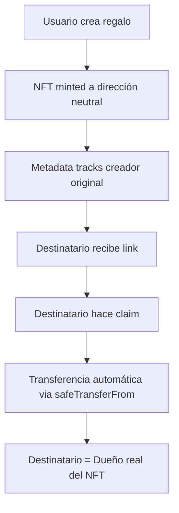

# CryptoGift Wallets - Regala el Futuro 🎁

Una plataforma revolucionaria para crear y regalar NFT-wallets con criptomonedas reales usando tecnología ERC-6551 (Token Bound Accounts).

## 🌟 Características Principales

- **🎁 Transferencia Automática**: El destinatario se convierte en dueño real del NFT automáticamente
- **🤖 Zero Custodia Humana**: Sistema programático sin regulaciones de custody
- **💼 NFT = Wallet**: Cada NFT tiene una wallet integrada que puede guardar criptomonedas reales
- **🎨 Arte IA**: Filtros de inteligencia artificial para crear arte único
- **⛽ Gas Gratis**: Todas las transacciones están patrocinadas por Paymaster
- **🛡️ Recuperación Social**: Sistema de guardianes para recuperar acceso
- **🔄 Swaps Integrados**: Cambio entre diferentes criptomonedas con 0x Protocol
- **💰 Programa de Referidos**: Gana dinero invitando amigos
- **🔍 Transparencia Total**: Reservas auditables on-chain en tiempo real
- **📱 Mobile-First UX**: Experience optimizada para dispositivos móviles
- **🔗 Deeplink Authentication**: Integración perfecta con MetaMask mobile
- **🖼️ Dynamic Image Layouts**: Ajuste automático de imágenes verticales/horizontales
- **🌐 Multi-Gateway IPFS**: Sistema de respaldo triple para máxima disponibilidad
- **🎓 Sistema de Educación**: Pre-claim education con módulos interactivos y certificación
- **🔐 EIP-712 Approvals**: Stateless signature verification con gas < 30k
- **📚 5 Módulos Educativos**: Desde wallet security hasta proyecto collaboration

### 🚀 **BREAKTHROUGH: Programmatic NFT Ownership Transfer**



## 🚀 Demo & Estado Actual

- **Web App**: [https://cryptogift-wallets.vercel.app](https://cryptogift-wallets.vercel.app) ✅ **LIVE**
- **Contratos**: Desplegados en Base Sepolia ✅ **OPERATIVOS** 
- **Dashboard**: Panel de transparencia con estadísticas en vivo ✅ **FUNCIONAL**

### 🎯 **ESTADO ACTUAL (Agosto 27, 2025):**

#### 🎓 **LATEST: EDUCATIONAL FLOW CRITICAL FIXES** ✅
- ✅ **EMAIL VERIFICATION**: Fixed Redis JSON parsing error (500 Internal Server Error resolved)
- ✅ **CONNECTBUTTON VISIBILITY**: Proper state management ensures button appears after education
- ✅ **INFINITE RE-RENDERS ELIMINATED**: Removed circular dependency in SalesMasterclass
- ✅ **EIP-712 FLOW RESTORED**: Signature generation works after wallet connection
- ✅ **COMPLETE FLOW**: checkboxes → success → wallet → EIP-712 → claim

#### 🚀 **PREVIOUS: WALLET DASHBOARD AUDIT & ROBUST GAS-PAID FALLBACK** ✅
- ✅ **DEEP SYSTEM AUDIT**: Fixed 30+ CSP blocking errors, corrected function selectors
- ✅ **GAS-PAID PRIMARY METHOD**: 100% functional as main transaction method
- ✅ **AUTO-DETECTION BICONOMY**: Runtime validation with automatic fallback

#### 📊 **PREVIOUS: CRITICAL MOBILE & UX FIXES** (Agosto 23, 2025) ✅
- ✅ **MOBILE IPFS UPLOADS FIXED**: Exponential backoff retry (2s→4s→8s) para uploads exitosos en primer intento
- ✅ **DAO SHOWCASE UNIFIED**: Sales Masterclass con celebración comunitaria en PreClaim y Knowledge
- ✅ **THEME TOGGLE FIX**: Cambio de tema sin redirección a página de inicio

#### 🎓 **PREVIOUS: UNIFIED EDUCATION SYSTEM + CRITICAL FIXES DEPLOYED** ✅
- ✅ **UNIFIED KNOWLEDGE ↔ EDUCATIONAL SYSTEM**: Same Sales Masterclass usado en ambos contextos sin duplicación
- ✅ **LESSON MODAL WRAPPER**: Modal universal con estructura GiftWizard para educación
- ✅ **AUTOMATIC LESSON REGISTRY**: Nuevas lecciones en Knowledge automáticamente disponibles en Educational Requirements
- ✅ **CRITICAL EDUCATION BUGS FIXED**: Claimer field, wallet connection timing, silent gateData fallbacks
- ✅ **CONFETTI CELEBRATION PERFECTED**: Sistema de celebración mejorado que funciona en ambos modos
- ✅ **MOBILE EDUCATION COMPATIBILITY**: Workflow completo mobile-ready con error handling robusto
- 🎯 **EDUCATION COMPLETION VERIFIED**: Flow completo de password → education → EIP-712 → claim funcional

#### 🚨 **PREVIOUS: MOBILE CLAIMING CRISIS RESOLVED** ✅
- ✅ **CRITICAL MOBILE FIX**: "Error de conexión" en mobile claims completamente resuelto
- ✅ **NFT IMAGE PARITY**: Mobile-claimed NFTs ahora muestran imágenes reales (no placeholders)
- ✅ **REDIS METADATA SYNC**: Frontend claims ahora actualizan Redis automáticamente
- ✅ **TYPESCRIPT CLEAN**: Compilation errors resolved, deployment ready
- ✅ **PC COMPATIBILITY**: Zero impact on existing PC functionality (que ya funcionaba perfecto)
- 🎯 **ROOT CAUSE FIXED**: Frontend vs Backend claim execution path unification completed

#### 🔄 **COMPREHENSIVE PLATFORM STATUS:**
- ✅ **MOBILE UX PERFECTION** - Comprehensive mobile experience optimization  
- ✅ **R1: DEEPLINK AUTHENTICATION** - MetaMask mobile automatic deeplink system
- ✅ **R2: NFT VISIBILITY ENHANCED** - Pre-pinning with instant MetaMask display
- ✅ **R3: SPANISH ERROR MESSAGES** - Corrected multilingual error interface
- ✅ **R4: VERTICAL IMAGE LAYOUTS** - ResizeObserver dynamic adjustment system
- ✅ **R5: AUTO THEME + ZOOM COMPENSATION** - Desktop scaling for optimal viewing
- ✅ **R6: IPFS GATEWAY RETRY SYSTEM** - Triple-gateway fallback with telemetry
- ✅ **EDUCATION GATE SYSTEM** - Pre-claim education with EIP-712 approvals
- ✅ **BASESCAN COMPATIBILITY** - NFT images display in block explorers
- ✅ **METAMASK COMPATIBILITY** - NFT images display properly in wallets
- ✅ **PRODUCTION STABILITY** - Critical runtime errors resolved
- ✅ **CI/CD COMPLIANCE** - All hardcodes eliminated, scripts secure
- ✅ **SECURITY HARDENING COMPLETED** - All critical vulnerabilities patched
- ✅ **PERFORMANCE OPTIMIZED** - 99% RPC reduction with persistent mapping
- ✅ **BUILD FIXES APPLIED** - All compilation errors resolved
- ✅ **SISTEMA CORE COMPLETADO** - NFT ownership transfer automático 
- ✅ **ZERO CUSTODIA HUMANA** - Transferencia programática sin regulaciones
- ✅ **ESCROW TEMPORAL** - Password-based gifts with auto-expiration
- ✅ **IGate COMPLIANCE** - SimpleApprovalGate deployed and verified on Base Sepolia
- 🚀 **FASE ACTUAL**: Production-ready education system with enterprise-grade security

## 🛠️ Tecnología

### Frontend
- **Next.js 15** - Framework React
- **ThirdWeb v5** - Web3 SDK con Account Abstraction
- **Tailwind CSS** - Styling con design tokens
- **TypeScript** - Type safety
- **Framer Motion** - Animaciones spring physics estándar

### Blockchain
- **Base Sepolia** - Layer 2 para transacciones rápidas y baratas
- **ERC-6551** - Token Bound Accounts
- **Account Abstraction** - UX simplificada con Paymaster
- **OpenZeppelin** - Contratos seguros y auditados

### APIs e Integraciones
- **PhotoRoom API v2** - Filtros IA para imágenes
- **0x Protocol v2** - Swaps descentralizados
- **NFT.Storage** - Almacenamiento IPFS
- **Vercel KV** - Rate limiting y session management
- **Upstash Redis** - Education progress tracking
- **Telegram Bot** - Alertas de monitoreo
- **SimpleApprovalGate** - IGate contract para pre-claim education

## 📦 Instalación

### Prerrequisitos
- Node.js 18+
- npm o yarn
- Wallet con fondos en Base Sepolia

### 1. Clonar el repositorio
```bash
git clone https://github.com/your-username/cryptogift-wallets.git
cd cryptogift-wallets
```

### 2. Instalar dependencias
```bash
cd frontend
npm install

# Instalar dependencias de Hardhat
cd ..
npm install
```

### 3. Configurar variables de entorno
```bash
cp .env.example .env.local
```

Edita `.env.local` con tus claves:
```env
# ThirdWeb (REQUERIDO)
NEXT_PUBLIC_TW_CLIENT_ID=your_thirdweb_client_id
TW_SECRET_KEY=your_thirdweb_secret_key

# Contratos en Base Sepolia (REQUERIDO)
NEXT_PUBLIC_CRYPTOGIFT_NFT_ADDRESS=0x_your_deployed_contract_address
NEXT_PUBLIC_ERC6551_REGISTRY_ADDRESS=0x000000006551c19487814612e58FE06813775758
NEXT_PUBLIC_ERC6551_IMPLEMENTATION_ADDRESS=0x2d25602551487c3f3354dd80d76d54383a243358

# Education System - SimpleApprovalGate (REQUERIDO)
NEXT_PUBLIC_SIMPLE_APPROVAL_GATE_ADDRESS=0x99cCBE808cf4c01382779755DEf1562905ceb0d2
APPROVER_PRIVATE_KEY=your_approver_private_key
APPROVER_ADDRESS=0x75e32B5BA0817fEF917f21902EC5a84005d00943

# Education System Configuration
EDUCATION_PASSWORD_ATTEMPTS_LIMIT=5
EDUCATION_SESSION_TTL=3600
EDUCATION_SIGNATURE_TTL=3600

# Redis/KV para sesiones y rate limiting (REQUERIDO)
UPSTASH_REDIS_REST_URL=your_upstash_redis_url
UPSTASH_REDIS_REST_TOKEN=your_upstash_redis_token
JWT_SECRET=your_jwt_secret_key

# NFT Storage (REQUERIDO)
NFT_STORAGE_API_KEY=your_nft_storage_api_key

# Opcional - Para funcionalidades avanzadas
PHOTOROOM_KEY=tu_clave_photoroom_aqui
TELEGRAM_TOKEN=tu_bot_token_aqui
```

### 4. Desplegar contratos (opcional)
```bash
# Compilar contratos
npx hardhat compile

# Desplegar en Base Sepolia
npx hardhat run scripts/deploy.ts --network base-sepolia
```

### 5. Ejecutar en desarrollo
```bash
cd frontend
npm run dev
```

La aplicación estará disponible en `http://localhost:3000`

## 🏗️ Arquitectura

### Contratos Inteligentes
```
contracts/
├── ReferralTreasury.sol    # Sistema de comisiones
└── (NFT Drop via ThirdWeb) # Mint de NFTs
```

### Frontend
```
frontend/src/
├── app/                    # App Router de Next.js
│   ├── page.tsx           # Página principal
│   ├── token/[...]/       # Página de wallet NFT
│   ├── knowledge/         # Sistema educativo completo
│   └── referrals/         # Panel de referidos
├── components/            # Componentes React
│   ├── learn/             # 🎓 SISTEMA UX MASTER
│   │   └── LearningPath.tsx # ⭐ COMPONENTE PATRÓN UX
│   ├── GiftWizard.tsx     # Wizard de creación
│   ├── WalletInterface.tsx # Interfaz de wallet
│   └── SwapModal.tsx      # Modal de swaps
├── pages/api/             # API Routes
│   ├── mint.ts            # Mint de NFTs
│   ├── swap.ts            # 0x Protocol
│   └── upload.ts          # IPFS upload
└── lib/                   # Utilidades
    ├── constants.ts       # Configuraciones
    └── errorHandler.ts    # Manejo de errores
```

### 🎨 Estándares de Diseño UX

El proyecto sigue **estándares obligatorios de UX** documentados en:
- `UX_DESIGN_STANDARDS.md` - Patrones de diseño oficial
- `components/learn/LearningPath.tsx` - Componente patrón maestro
- `app/knowledge/page.tsx` - Implementación de referencia

#### Principios UX Obligatorios:
- **Hover/Touch System**: Sin botones feos, interacción natural
- **Click Outside to Close**: UX sin interrupciones
- **Spring Physics**: stiffness: 300, damping: 25 (estándar)
- **Glass Morphism**: backdrop-blur-xl + transparencias
- **Mobile-First**: Touch events = Mouse events

## 🔧 Configuración Avanzada

### Paymaster (Gas Gratis)
El Paymaster está configurado automáticamente con ThirdWeb. Para monitorear el balance:
```bash
# Configurar alertas
chmod +x cron-setup.sh
./cron-setup.sh
```

### Rate Limiting
Configurar Vercel KV para protección anti-spam:
```env
VERCEL_KV_URL=redis://...
VERCEL_KV_REST_API_URL=https://...
VERCEL_KV_REST_API_TOKEN=...
```

### Filtros IA (PhotoRoom)
Para habilitar filtros de IA:
1. Registrarse en [PhotoRoom](https://photoroom.com/api)
2. Obtener API key
3. Añadir `PHOTOROOM_KEY` al `.env.local`

## 🚀 Deployment

### Vercel (Recomendado)
```bash
# Instalar Vercel CLI
npm i -g vercel

# Configurar secrets
vercel env add NEXT_PUBLIC_TW_CLIENT_ID
vercel env add TW_SECRET_KEY
vercel env add NFT_STORAGE_API_KEY
# ... (añadir todas las variables necesarias)

# Deploy
vercel --prod
```

### Variables de Entorno en Vercel
Asegúrate de configurar todas las variables de entorno en el dashboard de Vercel:
- `NEXT_PUBLIC_*` variables (públicas)
- `TW_SECRET_KEY` (privada)
- `NFT_STORAGE_API_KEY` (privada)
- Otras claves sensibles

## 🧪 Testing

### Tests Locales
```bash
# Unit tests
npm run test

# Type checking
npm run type-check

# Linting
npm run lint
```

### Tests de Contratos
```bash
# Tests con Hardhat
npx hardhat test

# Coverage
npx hardhat coverage
```

## 📊 Monitoreo

### Dashboard de Transparencia
- **Reservas Totales**: Fondos almacenados on-chain
- **Paymaster Balance**: Gas disponible
- **Transacciones**: Actividad en tiempo real
- **Referidos**: Estadísticas del programa

### Alertas Automáticas
- Balance bajo del Paymaster
- Errores en APIs
- Transacciones fallidas

## 🔒 Seguridad

### Auditorías
- Contratos basados en OpenZeppelin
- Rate limiting implementado
- Validación de entrada en todas las APIs
- Manejo seguro de claves privadas

### Mejores Prácticas
- Nunca commits claves privadas
- Usar variables de entorno para secrets
- Validar todas las entradas del usuario
- Implementar timeouts en APIs externas

## 🤝 Contribuir

1. Fork el proyecto
2. Crear una rama feature (`git checkout -b feature/AmazingFeature`)
3. Commit los cambios (`git commit -m 'Add some AmazingFeature'`)
4. Push a la rama (`git push origin feature/AmazingFeature`)
5. Abrir un Pull Request

## 📝 Roadmap

### v1.1 - Mejoras UX
- [ ] Modo oscuro
- [ ] Múltiples idiomas
- [ ] Tutorial interactivo
- [ ] Notificaciones push

### v1.2 - Funcionalidades Avanzadas
- [ ] Generador de arte IA completo
- [ ] Múltiples blockchains
- [ ] Marketplace de NFT-wallets
- [ ] Integración con redes sociales

### v2.0 - Escalabilidad
- [ ] Tokenización de activos reales
- [ ] API pública para developers
- [ ] White-label solution
- [ ] Mobile app nativa

## 📄 Licencia

MIT License - ver [LICENSE](LICENSE) para más detalles.

## 🚨 Errores Conocidos y Soluciones

### **ERROR DE ZOOM DESKTOP** 
**Síntomas:** Página se ve más grande de lo normal, requiere 90% zoom del navegador para verse bien
**Causa Raíz:** `X-Frame-Options: DENY` en headers de API endpoints interfiere con viewport
**Solución:** Cambiar `DENY` a `SAMEORIGIN` en endpoints de metadata
**Archivos Afectados:** `/api/nft-metadata/[contractAddress]/[tokenId].ts`
**Commit Problemático:** 8e2c7e2 (August 8, 2025)
**Fix Aplicado:** a18f526 + este commit

```javascript
// ❌ PROBLEMÁTICO:
res.setHeader('X-Frame-Options', 'DENY');

// ✅ CORRECCIÓN:
res.setHeader('X-Frame-Options', 'SAMEORIGIN');
```

**Detección:** Si la página requiere zoom <100% para verse normal, es este error.

---

## 🆘 Soporte

- **Discord**: [CryptoGift_Wallets_DAO](https://discord.gg/4zBvZnQB)
- **Farcaster**: [cryptogift-w](https://farcaster.xyz/cryptogift-w)
- **X/Twitter**: [@giftwalletcoin](https://x.com/giftwalletcoin?s=21)
- **YouTube**: [CryptoGift Channel](https://youtu.be/_CDc7GMVNhg)
- **Email**: admin@mbxart.com

## 💎 Créditos

**© 2025 The Moon in a Box, CryptoGift Wallets. All rights reserved.**

Desarrollado con ❤️ por el equipo de CryptoGift Wallets

**Tecnologías utilizadas:**
- [ThirdWeb](https://thirdweb.com) - Web3 Development Platform
- [Base](https://base.org) - Layer 2 Blockchain
- [0x Protocol](https://0x.org) - DEX Aggregation
- [PhotoRoom](https://photoroom.com) - AI Image Processing
- [NFT.Storage](https://nft.storage) - IPFS Storage
- [Vercel](https://vercel.com) - Deployment Platform

---

⭐ **¡Dale una estrella si te gusta el proyecto!** ⭐