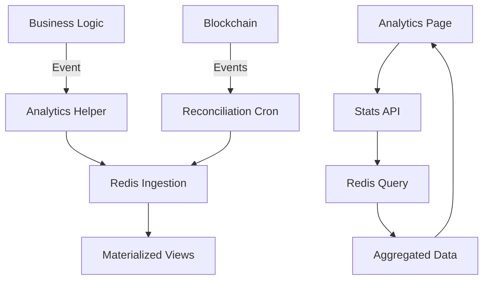

# 📊 Gift Analytics Dashboard - Guía Completa

## 🎯 Visión General

El **Gift Analytics Dashboard** es un sistema enterprise-grade de tracking y análisis de regalos NFT que proporciona visibilidad completa sobre las campañas de regalos, conversión, y comportamiento de usuarios.

### Características Principales

- 📊 **Tracking en tiempo real** de todos los estados del ciclo de vida del regalo
- 🎯 **Embudo de conversión** con métricas detalladas por etapa
- 📈 **Series temporales** con agregación por día/semana/mes
- 🔄 **Reconciliación automática** con eventos blockchain
- ⚡ **Rendimiento sub-milisegundo** con Redis materializado
- 🎨 **UI Glass Morphism** consistente con el design system de CryptoGift

---

## 🏭 Arquitectura

### Stack Tecnológico

#### Backend
- **Redis (Upstash)**: Almacenamiento materializado de métricas
- **Next.js API Routes**: Endpoints REST para stats y ingesta
- **Thirdweb v5**: Lectura de eventos blockchain
- **QStash**: Cron jobs serverless para reconciliación

#### Frontend
- **React 18**: Componentes con Suspense y concurrent features
- **Recharts**: Visualización de datos empresarial
- **Framer Motion**: Animaciones fluidas
- **Glass Morphism UI**: Design system premium

### Flujo de Datos



---

## 🚀 Implementación

### 1. Configuración Inicial

#### Variables de Entorno Requeridas

```env
# Redis (Upstash)
UPSTASH_REDIS_REST_URL=https://your-instance.upstash.io
UPSTASH_REDIS_REST_TOKEN=your-token

# Internal API Secret
INTERNAL_API_SECRET=your-secret-key

# QStash (para cron jobs)
QSTASH_URL=https://qstash.upstash.io
QSTASH_TOKEN=your-qstash-token

# Feature Flag
NEXT_PUBLIC_FEATURE_ANALYTICS=true
```

### 2. Integración con Flujos Existentes

#### A. Tracking en Mint (Creación de Regalo)

```typescript
// En /api/mint-escrow.ts
import { trackGiftCreated } from '@/lib/analyticsIntegration';

// Después del mint exitoso
await trackGiftCreated({
  tokenId: tokenId.toString(),
  giftId: giftCounter?.toString(),
  campaignId: campaignId || 'default',
  referrer: creatorAddress,
  value: giftAmount,
  txHash: escrowResult.transactionHash,
  metadata: {
    message: giftMessage,
    timeframe: timeframeDays,
    hasEducation: !!educationModules?.length
  }
});
```

#### B. Tracking en Claim (Reclamación)

```typescript
// En /api/claim-escrow.ts o ClaimEscrowInterface.tsx
import { trackGiftClaimed } from '@/lib/analyticsIntegration';

// Después del claim exitoso
await trackGiftClaimed({
  tokenId,
  giftId,
  campaignId: gift.campaignId,
  claimerAddress: account.address,
  txHash: claimTx.hash,
  value: gift.amount
});
```

#### C. Tracking de Vistas

```typescript
// En la página de claim/landing
import { trackGiftViewed } from '@/lib/analyticsIntegration';

useEffect(() => {
  trackGiftViewed({
    tokenId,
    campaignId,
    viewerIp: req.headers['x-forwarded-for']
  });
}, [tokenId]);
```

### 3. Configuración del Cron Job

#### Crear Schedule en QStash

```bash
curl -X POST https://qstash.upstash.io/v1/schedules \
  -H "Authorization: Bearer YOUR_QSTASH_TOKEN" \
  -H "Content-Type: application/json" \
  -d '{
    "destination": "https://your-app.vercel.app/api/referrals/_internal/reconcile",
    "cron": "*/15 * * * *",
    "headers": {
      "X-Internal-Secret": "your-secret"
    }
  }'
```

---

## 📋 Uso del Dashboard

### Acceso

Navega a `/referrals/analytics` en tu aplicación.

### Funcionalidades

#### 1. KPIs Principales
- **Total Regalos**: Número total de NFTs creados
- **Reclamados**: Gifts exitosamente reclamados
- **Valor Total**: Suma del valor de todos los regalos
- **Tiempo Promedio**: Tiempo desde creación hasta claim

#### 2. Gráficos Interactivos

##### Embudo de Conversión
Muestra la progresión de usuarios a través de cada etapa:
- Creados → Vistos → Pre-Claim → Educación → Reclamados

##### Distribución por Estado
Gráfico de pastel mostrando:
- Reclamados (verde)
- En proceso (azul)
- Expirados (rojo)
- Devueltos (naranja)
- Pendientes (gris)

##### Evolución Temporal
Gráfico de área mostrando tendencias por día/semana/mes.

#### 3. Tabla de Campañas

Detalle completo de cada campaña con:
- Nombre y ID
- Total de regalos
- Tasa de conversión
- Valor total
- Top referrer
- Acciones (ver detalles, exportar)

### Filtros Avanzados

- **Campañas**: Selección múltiple
- **Rango de fechas**: Selector de período
- **Estado**: Filtrar por estado específico
- **Agrupación**: Día, semana o mes
- **Tipo de gráfico**: Área, barras, líneas, pastel

### Exportación de Datos

Botón "Exportar CSV" genera un archivo con:
- Todas las campañas y sus métricas
- Formato compatible con Excel/Google Sheets
- Nombrado automático con fecha

---

## 🔒 Seguridad

### Autenticación

- **Dashboard**: Requiere wallet conectada
- **APIs internas**: Protegidas con `X-Internal-Secret`
- **Cron jobs**: Validación de firma QStash

### Rate Limiting

Implementado en endpoints críticos:
```typescript
// Máximo 100 requests por minuto
if (rateLimiter.isExceeded(ip)) {
  return res.status(429).json({ error: 'Too many requests' });
}
```

### Privacidad

- **Filtrado por owner**: Solo datos de tus campañas
- **Anonimización**: Direcciones mostradas parcialmente
- **Sin PII**: No se almacenan datos personales

---

## 🚫 Troubleshooting

### Problema: Stats no se actualizan

**Verificar**:
1. Redis conectado: `curl $UPSTASH_REDIS_REST_URL/ping`
2. Eventos enviados: Revisar logs de `trackGiftCreated`
3. Cron activo: Verificar en QStash dashboard

**Solución**:
```bash
# Forzar reconciliación manual
curl -X POST https://your-app/api/referrals/_internal/reconcile \
  -H "X-Internal-Secret: your-secret" \
  -d '{"fromBlock": 999000}'
```

### Problema: Duplicados en métricas

**Causa**: Eventos procesados múltiples veces

**Solución**: Verificar idempotencia
```typescript
// Cada evento debe tener eventId único
eventId: `${txHash}-${logIndex}`
```

### Problema: Timeout en reconciliación

**Causa**: Rango de bloques muy grande

**Solución**: Reducir ventana
```typescript
const maxBlockRange = 1000n; // Reducir de 2000
```

---

## 📈 Performance

### Métricas Objetivo

- **TTI Dashboard**: < 200ms (p95)
- **Query Redis**: < 10ms
- **Reconciliation**: < 2 min para 30 días
- **Export CSV**: < 1s para 1000 records

### Optimizaciones

#### 1. Caché Agresivo
```typescript
// Next.js caché con revalidación
export const revalidate = 60; // 1 minuto

// SWR en cliente
const { data } = useSWR('/api/stats', fetcher, {
  refreshInterval: 30000 // 30 segundos
});
```

#### 2. Agregación en Redis
```typescript
// Pre-calcular agregados
pipeline.hincrby(KEYS.campaignMeta(campaignId), 'total_claimed', 1);
```

#### 3. Paginación
```typescript
// Limitar resultados
const stats = await getCampaignStats({
  ...filter,
  limit: 50
});
```

---

## 🚀 Roadmap

### Fase 1 - MVP (Completado) ✅
- [x] Sistema de tracking básico
- [x] Dashboard con KPIs principales
- [x] Reconciliación con blockchain
- [x] Exportación CSV

### Fase 2 - Mejoras (Q1 2025)
- [ ] Real-time updates con WebSockets
- [ ] Alertas personalizadas
- [ ] Comparación de períodos
- [ ] Predicción de conversión con ML

### Fase 3 - Enterprise (Q2 2025)
- [ ] Dashboard personalizable
- [ ] Integración con Google Analytics
- [ ] API pública para partners
- [ ] White-label solution

---

## 📚 Referencias

- [Upstash Redis Docs](https://upstash.com/docs/redis)
- [QStash Schedules](https://upstash.com/docs/qstash/features/schedules)
- [Thirdweb v5 Events](https://portal.thirdweb.com/typescript/v5/getContractEvents)
- [Recharts Documentation](https://recharts.org)

---

*Última actualización: Enero 25, 2025*
*Sistema diseñado para escala enterprise con arquitectura event-driven*