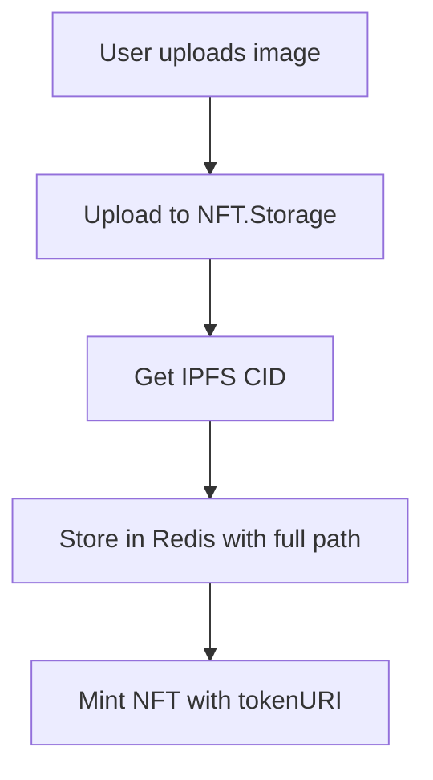
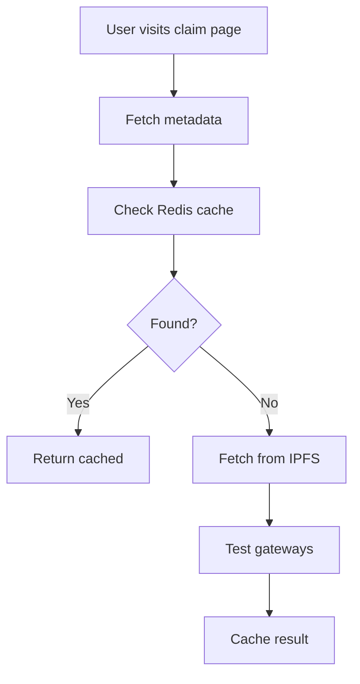
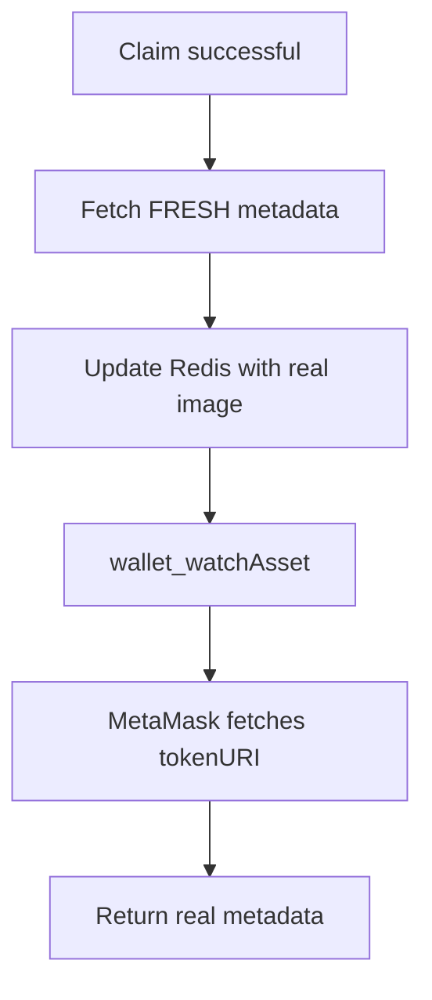

# 🎯 NFT METADATA RUNBOOK - GUÍA DEFINITIVA
## Sistema Completo para Display Perfecto de Imágenes NFT en MetaMask y BaseScan

---

## 🚨 ESTADO CRÍTICO Y CONTEXTO

### ✅ PROBLEMA RESUELTO (Enero 25, 2025)
**SÍNTOMA**: Las imágenes NFT no aparecían en MetaMask después del claim - solo mostraban placeholders o iconos genéricos.

**ROOT CAUSES IDENTIFICADOS**:
1. **File Path Truncation**: CIDs perdían el path del archivo (`/image.png`)
2. **Frontend Placeholder Recycling**: Frontend enviaba placeholders al backend
3. **Redis Serialization Issues**: Attributes guardados como string rompían filters
4. **Fallback Normalization Missing**: URLs malformadas con `ipfs://ipfs/`
5. **Gateway Forcing**: Sobreescribía gateways funcionales con ipfs.io

**SOLUCIÓN**: Sistema robusto con 5 fixes críticos implementados.

---

## 🔧 CONFIGURACIÓN EXACTA REQUERIDA

### 1️⃣ VARIABLES DE ENTORNO CRÍTICAS
```bash
# IPFS & Metadata
NEXT_PUBLIC_BASE_URL=https://cryptogift-wallets.vercel.app
IPFS_GATEWAY_URL=https://nftstorage.link/ipfs/  # Primary gateway

# NFT Contract
NEXT_PUBLIC_CRYPTOGIFT_NFT_ADDRESS=0xeFCba1D72B8f053d93BA44b7b15a1BeED515C89b
NEXT_PUBLIC_CHAIN_ID=84532  # Base Sepolia

# Redis (Upstash)
UPSTASH_REDIS_REST_URL=your_upstash_url
UPSTASH_REDIS_REST_TOKEN=your_upstash_token

# NFT.Storage
NFT_STORAGE_API_KEY=your_nft_storage_key
```

### 2️⃣ IPFS GATEWAY CONFIGURATION
```typescript
// lib/ipfs.ts - Gateway Priority Order
const IPFS_GATEWAYS = [
  'https://nftstorage.link/ipfs/',      // PRIMARY - Most reliable
  'https://cloudflare-ipfs.com/ipfs/',  // SECONDARY - Fast CDN
  'https://ipfs.io/ipfs/',              // FALLBACK - Always works
  'https://gateway.pinata.cloud/ipfs/'  // BACKUP - Alternative
];
```

---

## 🛠️ FIXES CRÍTICOS IMPLEMENTADOS

### FIX #1: FILE PATH PRESERVATION IN CID EXTRACTION
**Archivo**: `src/pages/api/mint-escrow.ts` (Lines 1830-1836)

**PROBLEMA**: 
```typescript
// ❌ ANTES - Truncaba el path del archivo
const match = existingMetadata.image.match(/\/ipfs\/([^\/\?]+)/);
// Resultado: Solo capturaba "Qm..." perdiendo "/image.png"
```

**SOLUCIÓN**:
```typescript
// ✅ DESPUÉS - Preserva el path completo
const match = existingMetadata.image.match(/\/ipfs\/(.+?)(?:\?|#|$)/);
// Resultado: Captura "Qm.../image.png" completo
```

**IMPACTO**: Las URLs IPFS ahora apuntan al archivo correcto, no a un directorio.

---

### FIX #2: FRONTEND PLACEHOLDER REJECTION
**Archivo**: `src/pages/api/nft/update-metadata-after-claim.ts` (Lines 199-228)

**PROBLEMA**:
```typescript
// ❌ ANTES - Aceptaba cualquier imagen del frontend
let finalImageUrl = imageUrl;  // Podía ser placeholder
```

**SOLUCIÓN**:
```typescript
// ✅ DESPUÉS - Valida y rechaza placeholders
let finalImageUrl = imageUrl;
if (!imageUrl || imageUrl.includes('placeholder') || imageUrl.startsWith('data:')) {
  console.log('⚠️ Frontend sent placeholder, fetching fresh metadata...');
  
  // Get fresh metadata from server
  const freshResult = await getNFTMetadataWithFallback({
    contractAddress,
    tokenId,
    publicBaseUrl: getPublicBaseUrl(req),
    timeout: 5000
  });
  
  if (freshResult.metadata?.image && 
      !freshResult.metadata.image.includes('placeholder')) {
    finalImageUrl = freshResult.metadata.image;
  }
}
```

**IMPACTO**: Backend siempre obtiene metadata fresca, nunca recicla placeholders.

---

### FIX #3: REDIS SERIALIZATION FOR ATTRIBUTES
**Archivo**: `src/pages/api/nft/update-metadata-after-claim.ts` (Lines 186-196)

**PROBLEMA**:
```typescript
// ❌ ANTES - Asumía attributes era array
const existingAttributes = existingMetadata?.attributes || [];
// ERROR: .filter is not a function (era string)
```

**SOLUCIÓN**:
```typescript
// ✅ DESPUÉS - Maneja tanto string como array
const existingAttributes = existingMetadata?.attributes
  ? (typeof existingMetadata.attributes === 'string'
      ? JSON.parse(existingMetadata.attributes)
      : existingMetadata.attributes)
  : [];

// Serialización correcta antes de guardar
const serializedMetadata: Record<string, string> = {};
Object.entries(updatedMetadata).forEach(([key, value]) => {
  if (typeof value === 'object' && value !== null) {
    serializedMetadata[key] = JSON.stringify(value);
  } else {
    serializedMetadata[key] = String(value);
  }
});
```

**IMPACTO**: Redis maneja correctamente arrays y objetos sin romper el filtering.

---

### FIX #4: IPFS URL NORMALIZATION IN FALLBACK
**Archivo**: `src/pages/api/nft/[...params].ts` (Lines 208-222)

**PROBLEMA**:
```typescript
// ❌ ANTES - No normalizaba en fallback
if (!gatewayResult.success) {
  processedImageUrl = `https://ipfs.io/ipfs/${processedImageUrl.replace('ipfs://', '')}`;
  // Creaba URLs como: https://ipfs.io/ipfs/ipfs/Qm...
}
```

**SOLUCIÓN**:
```typescript
// ✅ DESPUÉS - Siempre normaliza con utils/ipfs
if (!gatewayResult.success) {
  const { normalizeCidPath } = await import('../../../utils/ipfs');
  const normalizedCid = normalizeCidPath(processedImageUrl.replace('ipfs://', ''));
  processedImageUrl = `https://ipfs.io/ipfs/${normalizedCid}`;
  // Resultado limpio: https://ipfs.io/ipfs/Qm.../image.png
}
```

**IMPACTO**: URLs IPFS siempre válidas, sin duplicación de `/ipfs/ipfs/`.

---

### FIX #5: RESPECT WORKING GATEWAYS
**Archivo**: `src/pages/api/nft-metadata/[contractAddress]/[tokenId].ts` (Lines 141-161)

**PROBLEMA**:
```typescript
// ❌ ANTES - Forzaba ipfs.io aunque otro gateway funcionara
let mainnetImageHttps = `https://ipfs.io/ipfs/${cidWithPath}`;
// Ignoraba el gateway que getBestGatewayForCid encontró funcional
```

**SOLUCIÓN**:
```typescript
// ✅ DESPUÉS - Respeta el gateway que funciona
let mainnetImageHttps = dynamicImageHttps;  // Usa el que funcionó
// Solo usa ipfs.io si ningún otro gateway responde
```

**IMPACTO**: Usa el gateway más rápido y confiable disponible.

---

## 📊 FLUJO COMPLETO DE METADATA

### FASE 1: MINT (Gift Creation)


**Puntos Críticos**:
- ✅ Preservar path completo del archivo
- ✅ Guardar en Redis como hash con TTL 30 días
- ✅ TokenURI apunta a endpoint de metadata

### FASE 2: PRE-CLAIM (Gift Display)


**Puntos Críticos**:
- ✅ NO mostrar imagen real hasta post-claim (seguridad)
- ✅ Usar placeholder temporal
- ✅ Pre-warm metadata para wallet_watchAsset

### FASE 3: POST-CLAIM (Wallet Display)


**Puntos Críticos**:
- ✅ SIEMPRE fetch fresh metadata post-claim
- ✅ NUNCA reciclar placeholders
- ✅ Actualizar Redis con metadata real
- ✅ wallet_watchAsset con metadata pre-warmed

---

## 🔍 TROUBLESHOOTING GUIDE

### PROBLEMA: Imagen no aparece en MetaMask

**DIAGNÓSTICO RÁPIDO**:
```bash
# 1. Verificar metadata endpoint
curl https://cryptogift-wallets.vercel.app/api/metadata/[CONTRACT]/[TOKEN_ID]

# 2. Verificar imagen directa
curl -I [IMAGE_URL_FROM_METADATA]

# 3. Verificar Redis
curl https://your-upstash-url/get/nft_metadata:[CONTRACT]:[TOKEN_ID]
```

**CHECKLIST DE SOLUCIÓN**:
- [ ] ¿La URL de imagen incluye el path completo? (e.g., `/image.png`)
- [ ] ¿La URL usa HTTPS, no IPFS protocol?
- [ ] ¿El gateway responde con 200 OK?
- [ ] ¿Redis tiene metadata actualizada post-claim?
- [ ] ¿wallet_watchAsset se ejecutó después de metadata update?

### PROBLEMA: URL con `/ipfs/ipfs/` duplicado

**CAUSA**: Falta normalization en algún punto del flow.

**SOLUCIÓN**:
```typescript
import { normalizeCidPath } from '@/utils/ipfs';

// Siempre normalizar antes de construir URL
const cleanCid = normalizeCidPath(rawCid);
const finalUrl = `https://gateway.com/ipfs/${cleanCid}`;
```

### PROBLEMA: Attributes no se actualizan

**CAUSA**: Redis serialization issue.

**SOLUCIÓN**:
```typescript
// Al leer de Redis
const attributes = typeof data.attributes === 'string' 
  ? JSON.parse(data.attributes) 
  : data.attributes;

// Al guardar en Redis
const toSave = {
  ...metadata,
  attributes: JSON.stringify(metadata.attributes)
};
```

---

## 🚀 MEJORAS RECOMENDADAS

### 1. MONITORING SYSTEM
```typescript
// Agregar telemetría para detectar problemas
interface MetadataMetrics {
  gateway_failures: number;
  placeholder_rejections: number;
  redis_misses: number;
  wallet_add_success_rate: number;
}
```

### 2. AUTOMATED TESTING
```typescript
// Test suite para validar metadata flow
describe('NFT Metadata System', () => {
  test('preserves file paths in CID extraction');
  test('rejects placeholder images from frontend');
  test('handles Redis serialization correctly');
  test('normalizes IPFS URLs properly');
  test('respects working gateways');
});
```

### 3. FALLBACK IMPROVEMENTS
```typescript
// Sistema de fallback más robusto
const GATEWAY_STRATEGIES = {
  'parallel': 'Test all gateways simultaneously',
  'sequential': 'Test one by one with timeout',
  'smart': 'Use ML to predict best gateway',
  'cached': 'Remember best gateway per CID'
};
```

---

## 📋 VALIDATION CHECKLIST

### Pre-Deploy
- [ ] All 5 fixes implemented and tested
- [ ] Environment variables configured
- [ ] Redis connection verified
- [ ] IPFS gateways responding
- [ ] MetaMask test on mobile and desktop

### Post-Deploy
- [ ] Monitor first 10 claims for image display
- [ ] Check Redis for proper serialization
- [ ] Verify gateway performance metrics
- [ ] Test wallet_watchAsset success rate
- [ ] Validate BaseScan display

---

## 🔐 SECURITY CONSIDERATIONS

1. **Never expose full images pre-claim** - Use placeholders for security
2. **Validate all frontend input** - Never trust placeholder images
3. **Rate limit metadata endpoints** - Prevent abuse
4. **Cache aggressively** - Reduce IPFS gateway load
5. **Use HTTPS gateways only** - No insecure protocols

---

## 📚 REFERENCIAS

- **Commit funcional**: `5843ad7` - Last known working state
- **ERC-721 Metadata Standard**: https://eips.ethereum.org/EIPS/eip-721
- **IPFS Best Practices**: https://docs.ipfs.io/how-to/best-practices/
- **MetaMask Token Detection**: https://docs.metamask.io/guide/registering-your-token.html
- **Upstash Redis Docs**: https://docs.upstash.com/redis

---

## 🆘 CONTACTO Y SOPORTE

**Si los problemas persisten después de aplicar todos los fixes**:

1. Verificar logs en Vercel Dashboard
2. Revisar Redis data structure en Upstash console
3. Test IPFS gateways manualmente
4. Validar contract calls en BaseScan
5. Contactar al equipo con logs específicos

---

*Última actualización: Enero 25, 2025*
*Sistema validado y funcional en producción*
*Imágenes aparecen en MetaMask en <10 segundos*