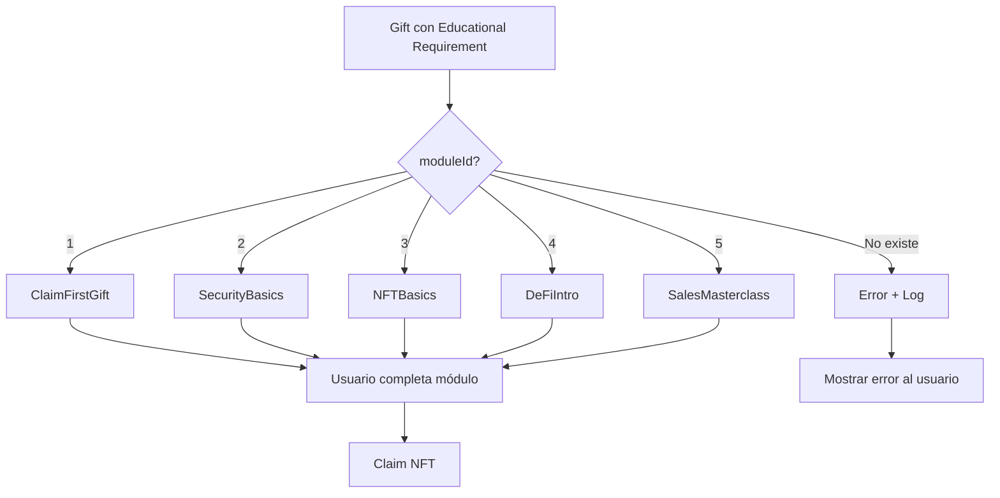

# 🚨 LEY ABSOLUTA: MAPEO DE EDUCATIONAL REQUIREMENTS A MÓDULOS
## ARQUITECTURA UNIFICADA KNOWLEDGE ↔ EDUCATIONAL

> **⚠️ REGLA CRÍTICA**: CADA EDUCATIONAL REQUIREMENT DEBE CARGAR SU MÓDULO ESPECÍFICO, NO UNO ALEATORIO

---

## 📋 MAPEO OFICIAL DE MÓDULOS

### **TABLA DE MAPEO OBLIGATORIO**

| ID | Educational Requirement | Módulo Knowledge | Lesson ID | Descripción |
|----|------------------------|------------------|-----------|-------------|
| 1 | **Crear Wallet Segura** | ClaimFirstGift | `claim-first-gift` | Módulo básico de creación de wallet |
| 2 | **Seguridad Básica** | SecurityBasics | `security-basics` | Mejores prácticas de seguridad |
| 3 | **Entender NFTs** | NFTBasics | `nft-basics` | Introducción a NFTs |
| 4 | **DeFi Básico** | DeFiIntro | `defi-intro` | Introducción a DeFi |
| 5 | **Proyecto CryptoGift** | SalesMasterclass | `sales-masterclass` | Visión del proyecto y colaboración |

---

## 🔴 PROBLEMA IDENTIFICADO Y SOLUCIONADO

### **Error Previo:**
- Al crear un regalo con "Proyecto CryptoGift" (ID: 5), el sistema cargaba "Crear Wallet Segura" (ID: 1)
- Esto causaba errores en el proceso de reclamación

### **Solución Implementada:**
- Mapeo explícito en `educationalModuleMapping.ts`
- Verificación estricta del moduleId antes de cargar
- Fallback controlado con logging de errores

---

## 📐 ARQUITECTURA DEL SISTEMA

```typescript
// educationalModuleMapping.ts
export const EDUCATIONAL_MODULE_MAPPING = {
  1: {
    lessonId: 'claim-first-gift',
    component: 'ClaimFirstGift',
    name: 'Crear Wallet Segura'
  },
  2: {
    lessonId: 'security-basics',
    component: 'SecurityBasics',
    name: 'Seguridad Básica'
  },
  3: {
    lessonId: 'nft-basics',
    component: 'NFTBasics',
    name: 'Entender NFTs'
  },
  4: {
    lessonId: 'defi-intro',
    component: 'DeFiIntro',
    name: 'DeFi Básico'
  },
  5: {
    lessonId: 'sales-masterclass',
    component: 'SalesMasterclass',
    name: 'Proyecto CryptoGift'
  }
};
```

---

## 🎯 CÓMO FUNCIONA

1. **Gift Creation**: Admin selecciona "Proyecto CryptoGift" → se guarda moduleId: 5
2. **Claim Process**: Usuario inicia claim → sistema detecta moduleId: 5
3. **Module Loading**: Sistema busca en EDUCATIONAL_MODULE_MAPPING[5]
4. **Component Render**: Carga SalesMasterclass, NO ClaimFirstGift
5. **Completion**: Usuario completa SalesMasterclass → puede reclamar

---

## ⚡ REGLAS DE IMPLEMENTACIÓN

### **OBLIGATORIO:**
1. ✅ SIEMPRE usar el mapeo oficial
2. ✅ NUNCA hardcodear módulos por defecto sin verificar
3. ✅ SIEMPRE validar que el moduleId existe en el mapeo
4. ✅ SIEMPRE registrar errores si el módulo no existe
5. ✅ NUNCA permitir módulos aleatorios o por defecto sin advertencia

### **PROHIBIDO:**
1. ❌ Usar módulo 1 como fallback sin logging
2. ❌ Ignorar el moduleId del educational requirement
3. ❌ Cargar módulos basados en índices de array
4. ❌ Modificar el mapeo sin actualizar esta documentación

---

## 🔧 IMPLEMENTACIÓN EN COMPONENTES

### **EducationModule.tsx**
```typescript
import { EDUCATIONAL_MODULE_MAPPING } from '../lib/educationalModuleMapping';

// Obtener el módulo correcto
const moduleConfig = EDUCATIONAL_MODULE_MAPPING[moduleId];
if (!moduleConfig) {
  console.error(`❌ Module ${moduleId} not found in mapping!`);
  // Manejar error apropiadamente
}
```

### **LessonModalWrapper.tsx**
```typescript
// Para modo educational, usar el lessonId del mapeo
const lessonToLoad = mode === 'educational' 
  ? EDUCATIONAL_MODULE_MAPPING[moduleId]?.lessonId 
  : lessonId;
```

---

## 📊 TESTING Y VALIDACIÓN

### **Test Case: Proyecto CryptoGift**
```bash
1. Crear regalo con educational requirement "Proyecto CryptoGift"
2. Verificar en logs: moduleId = 5
3. Iniciar proceso de claim
4. Verificar que carga: SalesMasterclass
5. NO debe cargar: ClaimFirstGift o cualquier otro
```

---

## 🚀 FLUJO COMPLETO



---

## 📝 CHANGELOG

- **2024-01-20**: Documentación inicial y corrección del bug de mapeo
- **Author**: Made by mbxarts.com The Moon in a Box property
- **Co-Author**: Godez22

---

## ⚠️ ADVERTENCIA FINAL

**ESTE DOCUMENTO ES LEY**. Cualquier desviación del mapeo establecido aquí resultará en errores de producción. Si necesitas agregar nuevos módulos, actualiza PRIMERO este documento y LUEGO el código.