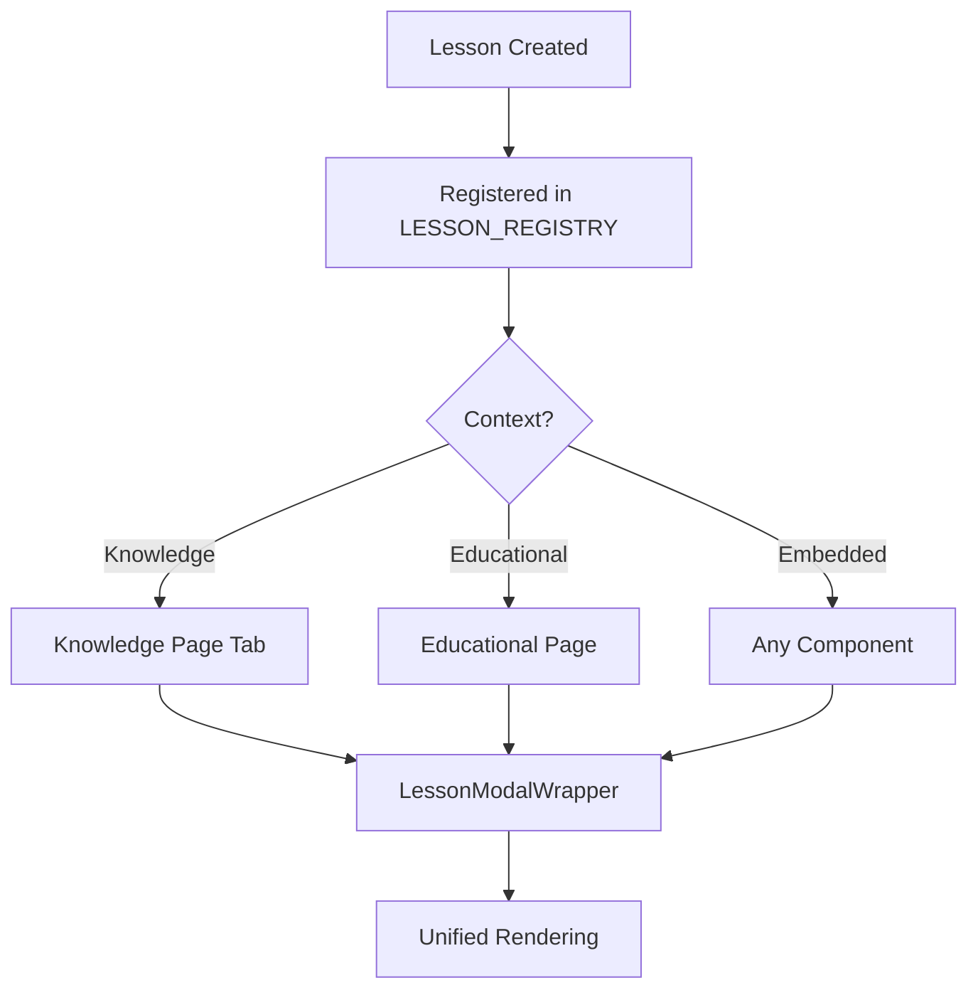
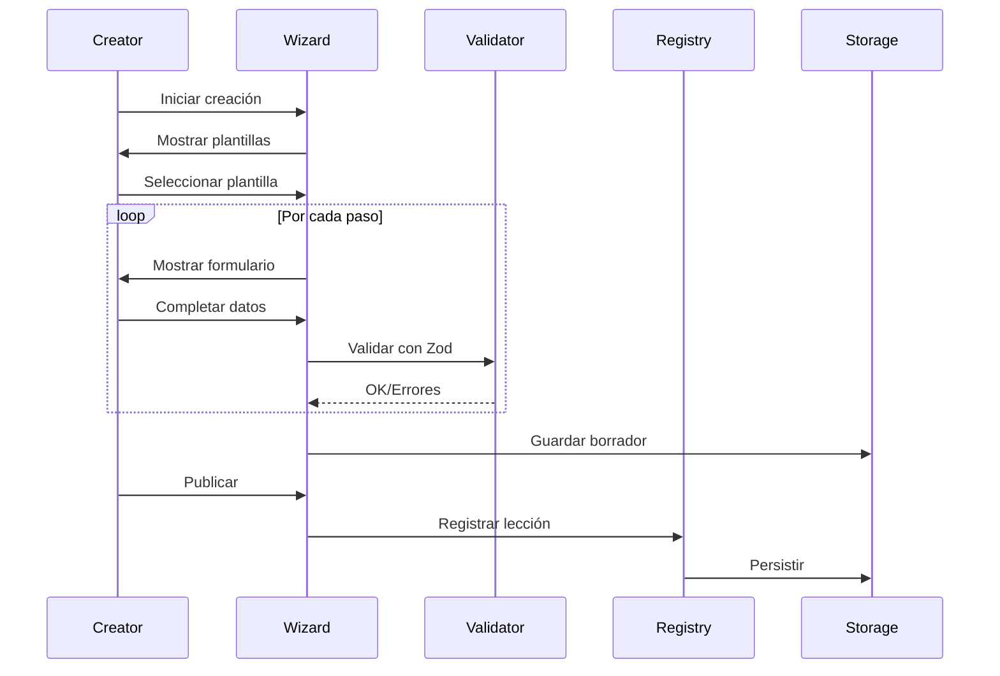
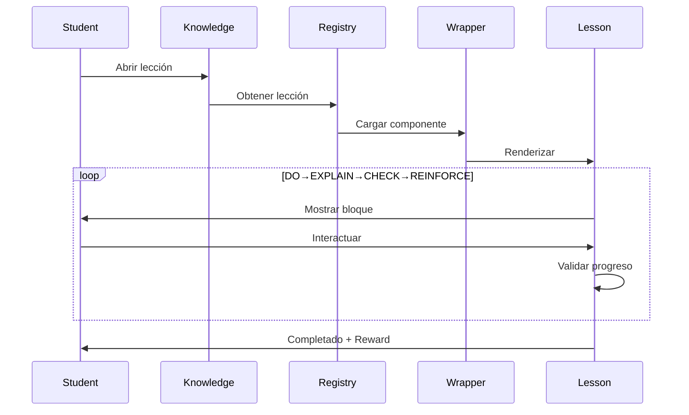

# 🏛️ KNOWLEDGE ACADEMY - ARQUITECTURA UNIFICADA

## 📋 TABLA DE CONTENIDOS
1. [Visión General](#visión-general)
2. [Arquitectura Unificada Knowledge ↔ Educational](#arquitectura-unificada)
3. [Sistema de Creación de Contenido](#sistema-de-creación)
4. [Patrón DO→EXPLAIN→CHECK→REINFORCE](#patrón-decr)
5. [Componentes Principales](#componentes-principales)
6. [Flujos de Trabajo](#flujos-de-trabajo)
7. [Estándares de Calidad](#estándares-de-calidad)

---

## 🎯 VISIÓN GENERAL

Knowledge Academy es el sistema educativo central de CryptoGift Wallets que unifica:
- **Aprendizaje Interactivo**: Lecciones gamificadas con el patrón DO→EXPLAIN→CHECK→REINFORCE
- **Creator Studio**: Sistema no-code para crear contenido educativo
- **Sistema Unificado**: Un único sistema que sirve tanto para Knowledge como Educational
- **Gestión de Contenido**: Creación, edición, publicación y análisis

### Principios Fundamentales
```typescript
const KNOWLEDGE_PRINCIPLES = {
  // 1. UNIFORMIDAD: Todo el contenido sigue el mismo formato
  contentPattern: 'DO → EXPLAIN → CHECK → REINFORCE',
  
  // 2. UNIFICACIÓN: Un sistema, múltiples contextos
  renderContexts: ['knowledge', 'educational', 'embedded'],
  
  // 3. AUTOMATIZACIÓN: Registro automático de lecciones
  autoRegistration: true,
  
  // 4. ESCALABILIDAD: Creator Studio para contenido infinito
  noCodeCreation: true
};
```

---

## 🔄 ARQUITECTURA UNIFICADA Knowledge ↔ Educational

### Sistema de Renderizado Unificado

```typescript
// CORE: LessonModalWrapper - El corazón del sistema
interface UnifiedArchitecture {
  // Un solo componente para TODOS los contextos
  wrapper: 'LessonModalWrapper',
  
  // Modos de renderizado
  modes: {
    knowledge: 'Dentro de Knowledge Academy',
    educational: 'En páginas educativas',
    embedded: 'En otros componentes'
  },
  
  // Registro automático
  registry: 'LESSON_REGISTRY',
  
  // Ejemplo perfecto funcionando
  example: 'Sales Masterclass'
}
```

### Componentes del Sistema Unificado

#### 1. **LessonModalWrapper** (`/components/education/LessonModalWrapper.tsx`)
```typescript
// Sistema central que renderiza TODAS las lecciones
export const LessonModalWrapper: React.FC<{
  lessonId: string;
  mode: 'knowledge' | 'educational';
  isOpen: boolean;
  onClose: () => void;
}> = ({ lessonId, mode, isOpen, onClose }) => {
  // Carga dinámica de la lección desde el registro
  const lesson = LESSON_REGISTRY[lessonId];
  
  // Renderizado uniforme independiente del contexto
  return <UnifiedLessonRenderer lesson={lesson} mode={mode} />;
};
```

#### 2. **Lesson Registry** (`/lib/lessonRegistry.ts`)
```typescript
// Registro automático de TODAS las lecciones
export const LESSON_REGISTRY: Record<string, LessonDefinition> = {
  'sales-masterclass': {
    component: () => import('@/components/learn/SalesMasterclass'),
    metadata: {
      title: 'Sales Masterclass',
      duration: 900, // 15 minutos
      pattern: 'DO→EXPLAIN→CHECK→REINFORCE'
    }
  },
  'claim-first-gift': {
    component: () => import('@/components/learn/ClaimFirstGift'),
    metadata: {
      title: 'Reclama tu Primer Regalo',
      duration: 420, // 7 minutos
      pattern: 'DO→EXPLAIN→CHECK→REINFORCE'
    }
  }
  // Nuevas lecciones se añaden automáticamente aquí
};
```

#### 3. **Knowledge Page** (`/app/knowledge/page.tsx`)
```typescript
// Página con sistema de pestañas
export default function KnowledgePage() {
  const [activeTab, setActiveTab] = useState<TabType>('learn');
  
  return (
    <Tabs value={activeTab}>
      <Tab value="learn">Aprender</Tab>
      <Tab value="create">Creator Studio</Tab>
      <Tab value="my-content">Mi Contenido</Tab>
      <Tab value="analytics">Analíticas</Tab>
    </Tabs>
  );
}
```

### Flujo de Datos Unificado



---

## 🎨 SISTEMA DE CREACIÓN DE CONTENIDO

### Creator Studio - Sistema No-Code

#### Arquitectura del Creator Studio
```typescript
interface CreatorStudioArchitecture {
  // Ubicación: Pestaña dentro de Knowledge
  location: '/knowledge?tab=create',
  
  // Componentes principales
  components: {
    wizard: 'CreatorWizard',      // Wizard paso a paso
    ruleBuilder: 'RuleBuilder',   // Constructor visual de reglas
    templates: 'TemplateLibrary', // Biblioteca de plantillas
    preview: 'ContentPreview'     // Vista previa en tiempo real
  },
  
  // Tipos de contenido
  contentTypes: ['lesson', 'campaign'],
  
  // Validación
  validation: 'Zod schemas',
  
  // Persistencia
  storage: {
    draft: 'localStorage',
    published: 'backend API'
  }
}
```

### Proceso de Creación Uniforme

```typescript
// PROCESO ESTÁNDAR PARA TODO CONTENIDO
const CONTENT_CREATION_PROCESS = {
  // Paso 1: Selección
  step1: {
    name: 'Elegir Tipo',
    options: ['lesson', 'campaign'],
    templates: '20+ plantillas predefinidas'
  },
  
  // Paso 2: Metadata
  step2: {
    name: 'Información Básica',
    fields: ['title', 'description', 'category', 'difficulty'],
    validation: 'required'
  },
  
  // Paso 3: Objetivos
  step3: {
    name: 'Objetivos de Aprendizaje',
    format: 'Lista de competencias',
    min: 3,
    max: 7
  },
  
  // Paso 4: Contenido (CRÍTICO)
  step4: {
    name: 'Bloques DO→EXPLAIN→CHECK→REINFORCE',
    blocks: {
      DO: 'Acción práctica (2-3 min)',
      EXPLAIN: 'Conceptos clave (2-3 min)',
      CHECK: 'Evaluación interactiva (1-2 min)',
      REINFORCE: 'Resumen y siguiente paso (1 min)'
    }
  },
  
  // Paso 5: Configuración
  step5: {
    name: 'Ajustes Educativos',
    settings: ['prerequisites', 'rewards', 'gamification']
  },
  
  // Paso 6: Revisión
  step6: {
    name: 'Preview y Publicación',
    actions: ['preview', 'test', 'publish']
  }
};
```

---

## 📐 PATRÓN DO→EXPLAIN→CHECK→REINFORCE

### Definición Estricta del Patrón

Este es el patrón **OBLIGATORIO** para TODO el contenido educativo:

```typescript
interface DECRPattern {
  // 1. DO - Hacer (25-35% del tiempo)
  DO: {
    purpose: 'Acción práctica inmediata',
    duration: '2-3 minutos',
    format: 'Interacción directa',
    examples: [
      'Conectar wallet',
      'Escanear QR',
      'Hacer una transacción',
      'Crear un NFT'
    ],
    requirements: {
      interactive: true,
      visual: true,
      feedback: 'immediate'
    }
  },
  
  // 2. EXPLAIN - Explicar (25-35% del tiempo)
  EXPLAIN: {
    purpose: 'Entender el por qué',
    duration: '2-3 minutos',
    format: 'Conceptos visualizados',
    examples: [
      'Por qué no pagaste gas',
      'Cómo funcionan los NFTs',
      'Qué es una blockchain'
    ],
    requirements: {
      simple: true,
      visual: true,
      analogies: true
    }
  },
  
  // 3. CHECK - Verificar (20-25% del tiempo)
  CHECK: {
    purpose: 'Confirmar comprensión',
    duration: '1-2 minutos',
    format: 'Quiz interactivo',
    types: [
      'multiple-choice',
      'true-false',
      'drag-drop',
      'fill-blank'
    ],
    requirements: {
      interactive: true,
      feedback: 'detailed',
      retry: true
    }
  },
  
  // 4. REINFORCE - Reforzar (15-20% del tiempo)
  REINFORCE: {
    purpose: 'Consolidar y proyectar',
    duration: '1 minuto',
    format: 'Resumen + Next Steps',
    components: [
      'Key takeaways (3 max)',
      'Achievement unlocked',
      'Next lesson recommendation',
      'Share progress'
    ],
    requirements: {
      celebration: true,
      summary: true,
      continuation: true
    }
  }
};
```

### Implementación del Patrón

```typescript
// EJEMPLO: Sales Masterclass siguiendo el patrón
const SalesMasterclassStructure = {
  // DO: Demo en vivo con QR
  block1: {
    type: 'DO',
    title: 'Experimenta el Poder del QR',
    content: 'Escanea este QR y reclama $5 USDC sin pagar gas',
    duration: 180 // 3 minutos
  },
  
  // EXPLAIN: Framework AIDA
  block2: {
    type: 'EXPLAIN',
    title: 'El Framework AIDA que Convierte',
    content: 'Attention → Interest → Desire → Action',
    duration: 180 // 3 minutos
  },
  
  // CHECK: Quiz de comprensión
  block3: {
    type: 'CHECK',
    title: 'Valida tu Comprensión',
    questions: [
      'Qué hace único a CryptoGift?',
      'Cuál es el ROI potencial?'
    ],
    duration: 120 // 2 minutos
  },
  
  // REINFORCE: Plan de acción
  block4: {
    type: 'REINFORCE',
    title: 'Tu Plan de $100M',
    keyPoints: [
      '✅ QR = Conversión instantánea',
      '✅ Sin gas = Sin fricción',
      '✅ Referrals = Crecimiento viral'
    ],
    nextStep: 'Crear tu primer regalo',
    duration: 60 // 1 minuto
  }
};
```

---

## 🧩 COMPONENTES PRINCIPALES

### Jerarquía de Componentes

```
/frontend/src/
├── app/
│   └── knowledge/
│       └── page.tsx                 # Página principal con tabs
├── components/
│   ├── education/
│   │   └── LessonModalWrapper.tsx   # Wrapper unificado
│   ├── learn/
│   │   ├── SalesMasterclass.tsx     # Ejemplo perfecto
│   │   ├── ClaimFirstGift.tsx       # Nueva lección
│   │   ├── ProgressRing.tsx         # Visualización progreso
│   │   ├── LearningPath.tsx         # Ruta de aprendizaje
│   │   ├── DailyTipCard.tsx         # Tips gamificados
│   │   └── AchievementSystem.tsx    # Sistema de logros
│   └── creator-studio/
│       ├── CreatorWizard.tsx        # Wizard de creación
│       └── RuleBuilder.tsx          # Constructor de reglas
├── lib/
│   ├── lessonRegistry.ts            # Registro de lecciones
│   └── creator-studio/
│       ├── types.ts                 # TypeScript types
│       ├── validation.ts            # Zod schemas
│       ├── templates.ts             # Plantillas
│       ├── jsonLogicEngine.ts       # Motor de reglas
│       └── utils.ts                 # Utilidades
└── pages/
    └── knowledge/
        ├── KNOWLEDGE_ARCHITECTURE.md # Este documento
        └── creator-studio/
            └── README.md             # Documentación Creator Studio
```

---

## 🔄 FLUJOS DE TRABAJO

### 1. Flujo de Creación de Lección



### 2. Flujo de Consumo de Lección



---

## ✅ ESTÁNDARES DE CALIDAD

### Checklist de Calidad para Contenido

```typescript
const QUALITY_STANDARDS = {
  // 1. FORMATO
  format: {
    pattern: 'DO→EXPLAIN→CHECK→REINFORCE', // OBLIGATORIO
    duration: '5-15 minutos',
    blocks: 4, // Exactamente 4 bloques
    interactive: true
  },
  
  // 2. CONTENIDO
  content: {
    language: 'Español simple',
    tone: 'Amigable y directo',
    examples: 'Casos reales',
    visuals: 'Mínimo 1 por bloque'
  },
  
  // 3. INTERACTIVIDAD
  interaction: {
    DO: 'Acción real en blockchain',
    EXPLAIN: 'Animaciones o diagramas',
    CHECK: 'Quiz con feedback',
    REINFORCE: 'Achievement + Share'
  },
  
  // 4. ACCESIBILIDAD
  accessibility: {
    mobile: 'Responsive obligatorio',
    loading: '< 3 segundos',
    offline: 'Contenido cacheado',
    a11y: 'WCAG 2.1 AA'
  },
  
  // 5. GAMIFICACIÓN
  gamification: {
    points: 'Por completar bloques',
    achievements: 'Por hitos',
    streak: 'Por consistencia',
    social: 'Compartir progreso'
  }
};
```

### Proceso de Review

```typescript
const REVIEW_PROCESS = {
  // Automático
  automated: {
    patternValidation: 'Verificar DO→EXPLAIN→CHECK→REINFORCE',
    durationCheck: 'Entre 5-15 minutos',
    interactivityTest: 'Elementos clickeables',
    accessibilityAudit: 'Lighthouse score > 90'
  },
  
  // Manual
  manual: {
    contentReview: 'Claridad y precisión',
    uxTesting: 'Flujo intuitivo',
    educationalValue: 'Objetivos cumplidos',
    engagement: 'Mantiene atención'
  },
  
  // Métricas de éxito
  metrics: {
    completionRate: '> 80%',
    averageRating: '> 4.5/5',
    retentionRate: '> 60%',
    shareRate: '> 20%'
  }
};
```

---

## 🚀 PRÓXIMOS PASOS

1. **Implementar componentes de cada paso del wizard**
2. **Crear sistema de persistencia en backend**
3. **Desarrollar preview interactivo**
4. **Añadir analytics en tiempo real**
5. **Crear marketplace de plantillas**
6. **Implementar AI content assistant**
7. **Desarrollar sistema de certificaciones**

---

## 📚 DOCUMENTACIÓN RELACIONADA

- [Creator Studio README](./creator-studio/README.md)
- [DEVELOPMENT.md](../../../DEVELOPMENT.md)
- [Knowledge System Master](./KNOWLEDGE_SYSTEM_MASTER.md)
- [Implementation Plan](./IMPLEMENTATION_PLAN.md)

---

*Made by mbxarts.com The Moon in a Box property*
*Co-Author: Godez22*