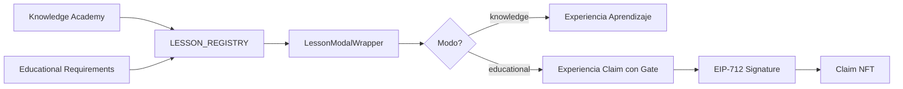

# 🏛️ ARQUITECTURA UNIFICADA KNOWLEDGE ↔ EDUCATIONAL

## 📌 PRINCIPIO FUNDAMENTAL

> **El sistema usa LessonModalWrapper para ambos modos (knowledge y educational)**
> 
> Las lecciones se registran en LESSON_REGISTRY y automáticamente están disponibles en ambos contextos

---

## 🔄 FLUJO DE DATOS



---

## 🎯 COMPONENTES CLAVE

### 1. **LessonModalWrapper**
- **Ubicación**: `/components/education/LessonModalWrapper.tsx`
- **Propósito**: Modal universal para lecciones
- **Modos**: 
  - `knowledge`: Aprendizaje voluntario
  - `educational`: Requisito para claim

### 2. **LessonModalWrapperForEducation**
- **Ubicación**: `/components/education/LessonModalWrapperForEducation.tsx`
- **Propósito**: Wrapper que maneja el mapeo de módulos
- **Función**: Asegura que cada educational requirement cargue su módulo ESPECÍFICO

### 3. **EDUCATIONAL_MODULE_MAPPING**
- **Ubicación**: `/lib/educationalModuleMapping.ts`
- **Propósito**: Fuente única de verdad para mapeo
- **Contenido**: Mapeo de moduleId → lessonId

---

## 📚 LECCIONES DISPONIBLES

| Lesson ID | Componente | Disponible en Knowledge | Disponible en Educational |
|-----------|------------|-------------------------|---------------------------|
| `sales-masterclass` | SalesMasterclass | ✅ | ✅ (Module 5) |
| `claim-first-gift` | ClaimFirstGift | ✅ | ✅ (Module 1) |
| `security-basics` | SecurityBasics | 🚧 | 🚧 (Module 2) |
| `nft-basics` | NFTBasics | 🚧 | 🚧 (Module 3) |
| `defi-intro` | DeFiIntro | 🚧 | 🚧 (Module 4) |

---

## 🔗 INTEGRACIÓN CON EDUCATIONAL REQUIREMENTS

### Cuando se crea un regalo con educational requirement:

1. **Admin selecciona**: "Proyecto CryptoGift" 
2. **Sistema guarda**: `moduleId: 5`
3. **Usuario inicia claim**: Sistema detecta `requiresEducation: true`
4. **Sistema busca**: `EDUCATIONAL_MODULE_MAPPING[5]`
5. **Resultado**: Carga `sales-masterclass`

### Flujo de datos:

```typescript
// 1. Gift creation
gift.educationModules = [5]; // Proyecto CryptoGift

// 2. Claim process
const moduleMapping = EDUCATIONAL_MODULE_MAPPING[5];
// Returns: { lessonId: 'sales-masterclass', ... }

// 3. Component render
<LessonModalWrapper 
  lessonId="sales-masterclass"
  mode="educational"
  ...
/>
```

---

## ⚙️ CONFIGURACIÓN DE NUEVAS LECCIONES

### Paso 1: Crear el componente de la lección
```typescript
// src/components/learn/MyNewLesson.tsx
export const MyNewLesson: React.FC<LessonProps> = ({ mode, onComplete }) => {
  // Implementación DO→EXPLAIN→CHECK→REINFORCE
};
```

### Paso 2: Registrar en LESSON_REGISTRY
```typescript
// src/lib/learn/lessonRegistry.ts
export const LESSON_REGISTRY = {
  // ...existing lessons
  'my-new-lesson': {
    component: MyNewLesson,
    metadata: { /* ... */ }
  }
};
```

### Paso 3: Agregar al mapeo educativo (si aplica)
```typescript
// src/lib/educationalModuleMapping.ts
export const EDUCATIONAL_MODULE_MAPPING = {
  // ...existing mappings
  6: {
    lessonId: 'my-new-lesson',
    component: 'MyNewLesson',
    name: 'Mi Nueva Lección',
    // ...
  }
};
```

### Paso 4: Actualizar documentación
- Actualizar `EDUCATIONAL_MAPPING_LAW.md`
- Actualizar esta documentación
- Agregar tests

---

## 🧪 TESTING

### Test Manual: Verificar Mapeo Correcto
```bash
1. Crear regalo con "Proyecto CryptoGift" como requirement
2. Iniciar proceso de claim
3. Verificar en consola: "Module ID: 5"
4. Verificar que carga: SalesMasterclass
5. NO debe cargar: ClaimFirstGift
```

### Test Automatizado
```typescript
// tests/educationalMapping.test.ts
describe('Educational Module Mapping', () => {
  it('should map Proyecto CryptoGift to SalesMasterclass', () => {
    const mapping = EDUCATIONAL_MODULE_MAPPING[5];
    expect(mapping.lessonId).toBe('sales-masterclass');
    expect(mapping.component).toBe('SalesMasterclass');
  });
});
```

---

## 📝 NOTAS IMPORTANTES

1. **NUNCA** hardcodear módulos por defecto sin verificar el mapeo
2. **SIEMPRE** usar `getModuleMapping()` para obtener el módulo correcto
3. **SIEMPRE** loggear errores si un módulo no está mapeado
4. **NUNCA** permitir que un educational requirement cargue un módulo aleatorio

---

## 🚨 ERRORES COMUNES Y SOLUCIONES

### Error: "Module X not found in mapping"
**Causa**: El moduleId no está en EDUCATIONAL_MODULE_MAPPING
**Solución**: Agregar el mapeo o verificar el ID

### Error: "Lesson not found in registry"
**Causa**: El lessonId no está en LESSON_REGISTRY
**Solución**: Registrar la lección o verificar el lessonId

### Error: Carga módulo incorrecto
**Causa**: No se está usando el mapeo centralizado
**Solución**: Usar `LessonModalWrapperForEducation` en lugar de acceso directo

---

## 📊 MÉTRICAS Y MONITOREO

- Loggear cada vez que se carga un módulo educativo
- Tracking de completación por módulo
- Alertas si un módulo falla en cargar
- Analytics de tiempo de completación

---

**Author**: Made by mbxarts.com The Moon in a Box property  
**Co-Author**: Godez22  
**Last Updated**: 2024-01-20